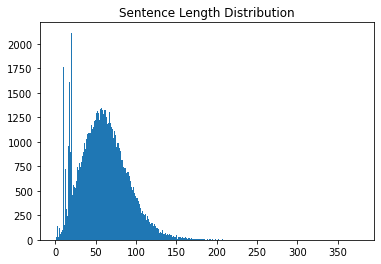
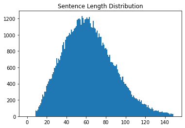

# 학습 내용

---

- 데이터 다운로드 및 분석
		- 학습 환경을 구성, 필요한 데이터 다운로드
- 공백 기반 토큰화
		- 공백 기반 토큰화 실습, 문제점 확인
- 형태소 기반 토큰화
		- KoNLPy, 그중에서도 가장 성능이 준수한 MeCab클래스 활용 실습

---

## 데이터 다운로드 및 분석

---

라이브러리 import

	'''

	import os

	import matplotlib.pyplot as plt
	import tensorflow as tf
	import numpy as np

	%matplotlib inline

	'''

데이터 다운

	'''

	# https://github.com/jungyeul/korean-parallel-corpora/raw/master/korean-english-news-v1/korean-english-park.train.tar.gz

	import os
	path_to_file = os.getenv('HOME')+'/aiffel/sp_tokenizer/data/korean-english-park.train.ko'

	with open(path_to_file, "r") as f:
	    raw = f.read().splitlines()

	print("Data Size:", len(raw))

	print("Example:")
	for sen in raw[0:100][::20]: print(">>", sen)

	'''

	결과:   Data Size: 94123
		Example:
		>> 개인용 컴퓨터 사용의 상당 부분은 "이것보다 뛰어날 수 있느냐?"
		>> 북한의 핵무기 계획을 포기하도록 하려는 압력이 거세지고 있는 가운데, 일본과 북한의 외교관들이 외교 관계를 정상화하려는 회담을 재개했다.
		>> "경호 로보트가 침입자나 화재를 탐지하기 위해서 개인적으로, 그리고 전문적으로 사용되고 있습니다."
		>> 수자원부 당국은 논란이 되고 있고, 막대한 비용이 드는 이 사업에 대해 내년에 건설을 시작할 계획이다.
		>> 또한 근력 운동은 활발하게 걷는 것이나 최소한 20분 동안 뛰는 것과 같은 유산소 활동에서 얻는 운동 효과를 심장과 폐에 주지 않기 때문에, 연구학자들은 근력 운동이 심장에 큰 영향을 미치는지 여부에 대해 논쟁을 해왔다.

문장의 최단 길이, 최장 길이, 평균 길이를 구한 후 문장 길이 분포 시각화

	'''

	min_len = 999
	max_len = 0
	sum_len = 0

	for sen in raw:
	    length = len(sen)
	    if min_len > length: min_len = length
	    if max_len < length: max_len = length
	    sum_len += length

	print("문장의 최단 길이:", min_len)
	print("문장의 최장 길이:", max_len)
	print("문장의 평균 길이:", sum_len // len(raw))

	sentence_length = np.zeros((max_len), dtype=int)

	for sen in raw:
	    sentence_length[len(sen)-1] += 1

	plt.bar(range(max_len), sentence_length, width=1.0)
	plt.title("Sentence Length Distribution")
	plt.show()

	'''

	결과:   문장의 최단 길이: 1
		문장의 최장 길이: 377
		문장의 평균 길이: 60

대체 길이가 1인 문장 확인

	'''

	def check_sentence_with_length(raw, length):
	    count = 0
    
	    for sen in raw:
	        if len(sen) == length:
	            print(sen)
	            count += 1
	            if count > 100: return

	check_sentence_with_length(raw, 1)

	'''

	결과: ’

문장의 수가 1500을 초과하는 문장 길이를 추출

	'''

	for idx, _sum in enumerate(sentence_length):
	    # 문장의 수가 1500을 초과하는 문장 길이를 추출합니다.
	    if _sum > 1500:
	        print("Outlier Index:", idx+1)

	'''

	결과:   Outlier Index: 11
		Outlier Index: 19
		Outlier Index: 21

길이가 11인 문장들 확인

	'''

	check_sentence_with_length(raw, 11)

	'''

	결과:   케냐 야생동물 고아원
		경유 1200원대로…
		더 내려야 하는 이유
		케냐 야생동물 고아원
		경유 1200원대로…
		더 내려야 하는 이유
		케냐 야생동물 고아원
			등등

중복을 제거한 후, 앞에서 분포를 확인

	'''

	min_len = 999
	max_len = 0
	sum_len = 0

	cleaned_corpus = list(set(raw))  # set를 사용해서 중복을 제거합니다.
	print("Data Size:", len(cleaned_corpus))

	for sen in cleaned_corpus:
	    length = len(sen)
	    if min_len > length: min_len = length
	    if max_len < length: max_len = length
	    sum_len += length

	print("문장의 최단 길이:", min_len)
	print("문장의 최장 길이:", max_len)
	print("문장의 평균 길이:", sum_len // len(cleaned_corpus))

	sentence_length = np.zeros((max_len), dtype=int)

	for sen in cleaned_corpus:   # 중복이 제거된 코퍼스 기준
	    sentence_length[len(sen)-1] += 1

	plt.bar(range(max_len), sentence_length, width=1.0)
	plt.title("Sentence Length Distribution")
	plt.show()

	'''

		-> 기본 자료형 set 활용해 중복 제거

	결과:   Data Size: 77591
		문장의 최단 길이: 1
		문장의 최장 길이: 377
		문장의 평균 길이: 64

길이가 10 미만, 길이 150 이상의 데이터 제거 후 시각화

	'''

	max_len = 150
	min_len = 10

	# 길이 조건에 맞는 문장만 선택합니다.
	filtered_corpus = [s for s in cleaned_corpus if (len(s) < max_len) & (len(s) >= min_len)]

	# 분포도를 다시 그려봅니다.
	sentence_length = np.zeros((max_len), dtype=int)

	for sen in filtered_corpus:
	    sentence_length[len(sen)-1] += 1

	plt.bar(range(max_len), sentence_length, width=1.0)
	plt.title("Sentence Length Distribution")
	plt.show()

	'''

---

## 공백 기반 토큰화

---

tokenize() 함수 정의

	'''

	def tokenize(corpus):  # corpus: Tokenized Sentence's List
	    tokenizer = tf.keras.preprocessing.text.Tokenizer(filters='')
	    tokenizer.fit_on_texts(corpus)

	    tensor = tokenizer.texts_to_sequences(corpus)

	    tensor = tf.keras.preprocessing.sequence.pad_sequences(tensor, padding='post')

	    return tensor, tokenizer

	'''

토큰화 진행

	'''

	# 정제된 데이터 filtered_corpus를 공백 기반으로 토큰화하여 저장하는 코드를 직접 작성해 보세요.
	split_corpus = []

	for kor in filtered_corpus:
	    split_corpus.append(kor.split())

	'''

단어 사전의 길이 확인

	'''

	split_tensor, split_tokenizer = tokenize(split_corpus)

	print("Split Vocab Size:", len(split_tokenizer.index_word))

	'''

	결과: Split Vocab Size: 237435

생성된 단어 사전 확인

	'''

	for idx, word in enumerate(split_tokenizer.word_index):
	    print(idx, ":", word)

	    if idx > 10: break

	'''

	결과:   0 : 이
		1 : 밝혔다.
		2 : 있다.
		3 : 말했다.
		4 : 수
		5 : 있는
		6 : 그는
		7 : 대한
		8 : 위해
		9 : 전했다.
		10 : 지난
		11 : 이번

---

## 형태소 기반 토큰화

---

사용할 한국어 형태소 분석기

	KoNLPy의 MeCab

형태소 분석

	'''

	def mecab_split(sentence):
	    return mecab.morphs(sentence)

	mecab_corpus = []

	for kor in filtered_corpus:
	    mecab_corpus.append(mecab_split(kor))

	'''

토큰화 진행

	'''

	mecab_tensor, mecab_tokenizer = tokenize(mecab_corpus)

	print("MeCab Vocab Size:", len(mecab_tokenizer.index_word))

	'''

	결과: MeCab Vocab Size: 52279

Q. 정교한 형태소분석기를 활용한 모델의 성능이 더 좋을 수 있음에도 불구하고 현장에서 SentencePiece 같은 Subword 기반 토크나이저가 더욱 각광받는 이유?

	A.  코퍼스데이터로부터 쉽게 추출해서 생성 가능
		-> Subword 기반이기 때문에 새롭게 생성되는 단어에 대한 OOV(Out-of-Vocabulary) 문제에 대해서도 robust하게 대처 가능
	    
	    언어에 중립적이기 때문에 여러 언어가 섞여 나오는 텍스트를 처리하는 데에도 능함

	    특정 언어에 대한 부가지식이 없이도 엔지니어가 그 언어에 대한 작업을 손쉽게 진행할 수 있도록 해준다는 점

	    그 언어에 특화된 토크나이저의 성능에 뒤지지 않거나 대체로 능가하는 성능을 보여줌

Encoding -> Decoding

	- tokenizer.sequences_to_texts() 함수 사용
	- tokenizer.index_word 사용

1. tokenizer.sequences_to_texts()

	'''

	texts = mecab_tokenizer.sequences_to_texts([mecab_tensor[100]])
	print(texts[0])

	'''

	결과: 수사관 들 은 건물 내 에 아홉 시간 동안 머물렀 다 .

2. tokenizer.index_word

	'''

	sentence = ""

	for w in mecab_tensor[100]:
	    if w == 0: continue
	    sentence += mecab_tokenizer.index_word[w] + " "

	print(sentence)

	'''

	결과: 수사관 들 은 건물 내 에 아홉 시간 동안 머물렀 다 . 
