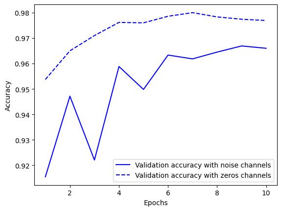
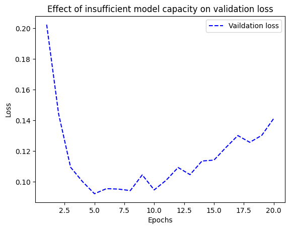
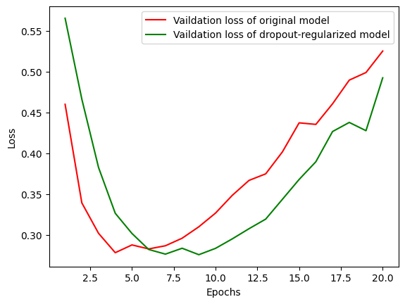

# 학습 내용

---

- 일반화: 머신 러닝의 목표
- 머신 러닝 모델 평가
- 훈련 성능 향상하기
- 일반화 성능 향상하기

---

## 일반화: 머신 러닝의 목표

---

머신 러닝의 근본적인 이슈

	-> 최적화와 일반화 사이의 줄다리기

최적화?

	가능한 훈련 데이터에서 최고의 성능을 얻으려고 모델의 조정하는 과정

일반화?

	훈련된 모델이 이전에 본 적 없는 데이터에서 얼마나 잘 수행되는지 의미

---

목표

	좋은 일반화 성능을 얻는 것

---

### 과소적합과 과대적합

---

	전형적인 과대적합 진행 과정

과소적합

	훈련 데이터의 손실이 낮아질수록 테스트 데이터의 손실도 낮아짐

과대적합

	훈련 데이터에서 훈련을 특정 횟수만큼 반복하고 난 후에는 일반화 성능이 더 이상 높아지지 않으며 검증 세트의 성능이 멈추고 감소되기 시작

---

과대적합 이유

	1. 잡음 섞인 훈련 데이터
	
		ex) mnist 데이터에 이상한 훈련 샘플 / 레이블이 잘못된 훈련 샘플이 존재함

		    모델이 이런 이상치를 맞추려고 하면 

			-> 일반화 성능 감소

	2. 불확실한 특성

		불확실성과 모호성이 있다면

			-> 깔끔하게 레이블이 부여된 데이터라도 잡음이 생길 수 있음

		ex) 바나나 이미지 

			바나나가 덜 익었는지, 익었는지 또는 썩었는지 예측이 불가능

	3. 드문 특성과 가짜 상관관계

		ex) 평생 두 마리의 주황색 얼룩무늬 고양이만 보았고 둘 다 사교성이 매우 없다면

			-> 주활색 얼룩무늬 고양이는 일반적으로 사교적이지 않다고 추측 가능

		중요한점!

			-> 가짜 상관관계를 만들어 내는 데 특성 값이 몇번만 등장할 필요가 없다는 것

				-> 과대적합의 가장 보편적인 원인 중 하나

---

3번 예제

	백색 잡음 픽셀과 0픽셀 추가

	'''
	
	from tensorflow.keras.datasets import mnist
	import numpy as np

	(train_images, train_labels),_=mnist.load_data()

	train_images=train_images.reshape((60000,28*28))
	train_images=train_images.astype("float32")/255
	train_images_with_noise_channels=np.concatenate(
	    [train_images,np.random.random((len(train_images),784))], axis=1
	)
	train_images_with_zeros_channels=np.concatenate(
	    [train_images,np.zeros((len(train_images),784))], axis=1
	)

	from tensorflow import keras
	from tensorflow.keras import layers

	def get_model():
	  model=keras.Sequential([
	      layers.Dense(512,activation="relu"),
	      layers.Dense(10,activation="softmax")
	  ])
	  model.compile(
	      optimizer="rmsprop",
	      loss="sparse_categorical_crossentropy",
	      metrics=["accuracy"])
	  return model

	model=get_model()
	history_noise=model.fit(
	    train_images_with_noise_channels,train_labels,batch_size=128,epochs=10,validation_split=0.2
	)

	model=get_model()
	history_zeros=model.fit(
	    train_images_with_zeros_channels,train_labels,batch_size=128,epochs=10,validation_split=0.2
	)

	import matplotlib.pyplot as plt

	val_acc_noise=history_noise.history["val_accuracy"]
	val_acc_zeros=history_zeros.history["val_accuracy"]
	epochs=range(1,11)
	plt.plot(epochs,val_acc_noise,"b-",label="Validation accuracy with noise channels")
	plt.plot(epochs,val_acc_zeros,"b--",label="Validation accuracy with zeros channels")
	plt.xlabel("Epochs")
	plt.ylabel("Accuracy")
	plt.legend()
	plt.show()

	'''

	잡음이 섞인 데이터에서 훈련된 모델의 검증 정확도 1% 포인트 낮음

		-> 가짜 상관관계의 영향 때문

잡음 특성

	특성 선택을 수행해 모델에 유익한 특성만 남겨야함

		1. 특성과 레이블 사이의 상호 의존 정보처럼 작업에 대해 특성이 얼마나 유익한지 측정(유용성 점수 계산)
		2. 임계 값을 넘긴 특성만 사용

			-> 백색 잡음이 걸러짐

---

### 딥러닝에서 일반화의 본질

---

표현 능력이 충분하다면

	-> 어떤 것에도 맞추도록 훈련 가능

랜덤하게 섞은 레이블로 MNIST 모델 훈련

	'''

	(trian_images,train_labels),_=mnist.load_data()
	train_images=train_images.reshape((60000,28*28))
	train_images=train_images.astype("float32")/255

	random_train_labels=train_labels[:]
	np.random.shuffle(random_train_labels)

	model=keras.Sequential([
	    layers.Dense(512,activation="relu"),
	    layers.Dense(10,activation="softmax")
	])

	model.compile(
	    optimizer="rmsprop",
	    loss="sparse_categorical_crossentropy",
	    metrics=["accuracy"]
	)

	model.fit(
	    train_images,
	    random_train_labels,
	    batch_size=128,
	    epochs=100,
	    validation_split=0.2
	)

	'''

		모델 파라미터가 충분하다면 모델을 훈련할 수 있음

---

딥러닝 모델의 일반화?

	딥러닝 모델 자체와 거의 관련이 없고,

		-> 실제 세상의 구조와 많은 관련이 있음

---

매니폴드 가설?

Mnist 입력: 28*28(정수배열) / 매우 적은 수만 유요한 Mnist 샘플

	- 유효한 손글씨 숫자의 부분 공간은 연속적
	- 하나의 샘플을 조금 수정해도 여전히 같은 손글씨 숫자로 인식
	- 유효한 부분  공간 안에 있는 모든 샘플은 이 부분 공간을 가로지르는 매끈한 경로로 연결 되어있음
		- ex)  2개의 Mnist 숫자 A, B를 무작위로 선택하면 A를 B로 변형시키는 연속적인 중간 이미지가 있음

	
	기술적으로 손글씨 숫자가 가능한 모든 28*28 uint8배열로 이루어진 공간 안에서 매니폴드를 형성한다!

		-> 매니 폴드?

			국부적으로 선형(유클리드) 공간과 비슷하게 보이는 부모 공간의 저차원 부분 공간!!

매니폴드 가설?

	실제 세상의 모든 데이터가 고차원 공간 안에 있는 매니폴드에 놓여 있다고 가정

		-> 이것이 맞다면 딥러닝이 작동하는 이유!!!!

	- 머신 러닝 모델은 가능한 입력 공간 안에서 비교적 간단하고, 저차원이며, 매우 구조적인 부분 공간(잠재 매니폴드)만 학습하면 됨
	- 매니폴드 중 하나 안에서 두 입력 사이의 보간(중간 값을 찾는 프로세스)하는것이 항상 가능 함
		- 즉, 연속적인 경로를 따라 한 입력에서 다른 입력으로 변형할 때 모든 포인트가 이 매니폴드에 속함

---

일반화의 원천인 보간

	공간 안의 샘플만 사용해서 공간 전체응 이해할 수 있음

		-> 보간을 사용해 빈 곳을 채울 수 있기 때문

	매니폴드 보간 -> 숫자 매니폴드에서 모든 포인트로 유효한 숫자가 됨

	선형 보간(일반적인 보간) -> 두 숫자의 평균을 하면 유효한 숫자 X

		근사적으로 학습된 데이터 메니폴드에서 보간을 통해 딥러닝의 일반화가 달성
		
			-> 빙산의 일각!

	보간은 이전에 본 것과 매우 가까운 것을 이해하는 데 도움을 줄 수 있을 뿐

		-> 지역 일반화

사람의 인지 메커니즘으로 궁극 일반화 가능

---

딥러닝이 작동하는 이유

딥러닝

	잠재 매니폴드를 풀기 위한 도구

	근본적으로 매우 고차원의 곡선(미분 가능해야 하기 때문)

	경사 하강법을 통해 곡선을 부드럽고 점진적으로 데이터 포인트에 맞춤

		- 충분히 오래 훈련 -> 훈련 데이터를 외워 버려 일반화 X
	
	데이터는 입력 공간 안에서 고도로 구조적린 저차원의 매니폴드를 형성 -> 매니폴드 가설

	모델이 데이터의 매니폴드를 대략적으로 근사하는 중간 지점이 있음

	그 지점에서 모델이 학습한 곡선을 따라 이동하는 것 ≒  데이터의 실제 잠재 매니폴드를 따라 이동하는것

		∴ 모델이 훈련 입력 사이를 보간하여 이전에 본 적 없는 입력을 이해 O

딥러닝 모델이 잠재 매니폴드를 학습하는 데 특히 잘 맞는 속성

	- 입력 ~ 출력 매끄러운 연속적인 매핑을 구현(미분 가능해야 하기 때문). 
		- 이런 매끄러움은 동일한 속성을 가진 잠재 매니폴드 를 근사하는 데 도움이 됨
	- 훈련 데이터에 있는 정보의 형태를 반영하는 식으로 구조화 되는 경향이 있음
		- 이는 자연적인 데이터가 구성되는 방식을 반영

---

가장 중요한 훈련 데이터

딥러닝이 실제로 매니폴드 학습에 잘 맞지만

	일반화 능력은 데이터의 자연적인 구조로 인한 결과

	데이터가 보간할 수 있는 매니폴드를 형성 -> 일반화 가능

	특성이 유익, 잡음이 적을수록 입력공간이 더 간단하고 구조적 -> 더 잘 일반화 가능

		-> 데이터 큐레이션, 특성 공학은 일반화에 필수적!!!

	입력 공간을 조밀하게 샘플링하여 훈련 

		조밀한 샘플링?

			-> 입력 데이터 매니폴드 전체를 조밀하게 커버해야 한다는 의미

		결정 경계 근처에서는 특히 중요

		충분히 조밀하게 샘플링 -> 외부 지식을 사용하지 않고 훈련 입력 사이를 보간하여 새로운 입력을 이해할 수 있음

	∴ 딥러닝 모델을 향상시키는 가장 좋은 방법 

		-> 더 좋고, 더 많은 데이터에서 훈련하는 것

	데이터를 더 수집하는 것이 불가능 할 때

		-> 정보량을 조정, 모델 곡선의 매끄러운 정도에 제약을 추가

규제?

	과대적합과 싸우는 과정

---

## 머신 러닝 모델 평가

---

모델의 일반화 성능을 신뢰 있게 측정 가능 해야함

---

### 훈련, 검증, 테스트 세트

---

모델 평가의 핵심

	가용한 데이터를 항상 훈련, 검증, 테스트 3개의 세트로 나누는 것

		- 훈련 세트 -> 모델 훈련
		- 검증 세트 -> 모델 평가
		- 테스트 세트 -> 모델을 최종적으로 딱 한 번 모델 테스트
			- 가능한 제품 환경의 데이터와 비슷해야 함

---

	검증 세트에서 모델의 성능을 평가하며 하이퍼파라미터 튜닝 수행

		-> 좋은 설정을 찾는 학습

	검증 세트의 성능을 기반으로 모델의 설정을 튜닝 

		-> 검증 세트에 과대적합(정보 누설)

정보 누설

	모델의 하이퍼파라미터를 조정할 때마다 검증 데이터에 관한 정보가 모델로 새는 것

		-> 여러번 반복하게 되면 검증 세트에 관한 정보를 모델에 많이 노출하게 됨

	모델은 간접적으로도 테스트 세트에 대한 어떠한 정보도 얻어선 안 됨

		-> 테스트 세트 성능을 기초해 튜닝한 모델의 모든 설정은 일반화 성능을 외곡!!!!

---

데이터를 훈련, 검증, 테스트 세트로 나누는 방법

	- 홀드아웃 검증
	- K-겹 교차 검증
	- 셔플링을 사용한 반복 k-겹 교차 검증

1. 단순 홀드아웃 검증

	데이터의 일정량을 테스트로 떼어 놓고, 남은 데이터에서 훈련하고, 테스트 세트로 평가

	'''

	num_validation_samples=10000
	np.random.shuffle(data)
	validation_data=data[:num_validation_samples]
	training_data=data[num_validation_samples:]

	# 모델 정의 및 훈련 평가

	'''

		단점 한가지 - 데이터가 적을 때 검증 세트와 테스트 세트의 샘플이 너무 적어짐

					-> 주어진 전체 테이터를 통계적으로 대표하지 못할 수 있음

2. k-겹 교차 검증

	1. 데이터를 동일한 크기를 가지 k개의 분할로 나눔 
	2. 각 분할 i에 대해 남은 k-1개의 분할로 모델을 훈련 -> 분할 i에서 모델을 평가
	3. 최종 점수 -> k개의 점수를 평균

		- 모델의 성능이 데이터 분할에 따라 편차가 클때 도움이 됨
		- 모델의 튜닝에 별개의 검증 세트 사용

	'''

	k=3
	num_validation_samples=len(data)//K
	np.random.shuffle(data)
	validation_scores=[]

	for fold in range(k):
	  validation_data=data[num_validation_samples*fold:
	                       num_validation_samples*(fold+1)]
	  training_data=np.concatenate(data[:num_validation_samples*fold],
	                     data[num_validation_samples*(fold+1):])

	  # 모델 정의 및 훈련 평가

	'''

3. 셔플링을 사용한 반복 k-겹 교차 검증

	비교적 가용 데이터가 적고 가능한 정확하게 모델을 평가하고자 할 때 사용

	- k-겹 교차검증을 여러 번 적용하되 k개의 분할로 나누기 전에 매번 데이터를 무작위로 섞음
		- 나머지는 k-겹 교차 검증과 동일함
	- 비용이 매우 많이 듬

---

### 상식 수준의 기준점 넘기

---

	매니폴드 학습 과정을 관찰 X

		-> 유일한 피드백: 검증 지표

	데이터셋으로 작업을 시작하기 전에 항상 넘어야 할 간단한 기준점을 정해야 함

		-> 이 임계값을 넘으면 제대로 하고 있음을 나타냄
			
			-> 기준점의 ex) 랜덤한 분류기의 성능

	상식 수준의 기준점을 가지는것 -> 필수!!

		-> 단순한 해결책보다 낫지 않다면 쓸모없는 모델

---

### 모델 평가에 대해 유념해야 할 점

---

- 대표성 있는 데이터

	훈련 세트와 테스트 세트가 주어진 데이터에 대한 대표성이 있어야 함

		ex) Mnist 데이터

			훈련 세트(80%), 테스트 세트(20%) -> 훈련 세트에는 0~7, 테스트 세트에는 8~9 만 담기게 됨

		-> 훈련 세트와 테스트 세트를 나누기 전에 데이터를 무작위로 섞는 것이 일반적

- 시간의 방향

	과거로부터 미래를 예측한다면 데이터를 분할하기 전에 무작위로 섞으면 절대 안됨

		-> 미래의 정보가 누설되기 때문
		
			-> 훈련게트에 있는 데이터보다 테스트 세트에 있는 모든 데이터가 미래의 것이어야 함

- 데이터 중복

	한 데이터셋에 어떤 데이터 포인트가 두 번 등장 -> 훈련 세트와 검증 세트에 데이터 포인트가 중복될 수 있음

---

## 훈련 성능 향상하기

---

목표 -> 과대적합 모델을 얻어 일반화 성능을 개선하는 것

문제

	- 훈련이 잘 되지 않음
	- 훈련은 잘 시작되었지만 모델이 의미 있는 일반화를 달성 하지 못함
	- 과대 적합 X

---

### 경사 하강법의 핵심 파라미터 튜닝하기

---

	일반적으로 나머지 파라미터를 고정하고 학습률과 배치 크기를 튜닝하는 것 으로 충분

	'''

	from tensorflow.keras.datasets import mnist
	from tensorflow import keras
	from tensorflow.keras import layers

	(train_images, train_labels),_=mnist.load_data()

	train_images=train_images.reshape((60000,28*28))
	train_images=train_images.astype("float32")/255

	model=keras.Sequential([
	    layers.Dense(512,activation="relu"),
	    layers.Dense(10,activation="softmax")
	])

	model.compile(
	    optimizer=keras.optimizers.RMSprop(1.),
	    loss="sparse_categorical_crossentropy",
	    metrics=["accuracy"]
	)

	model.fit(
	    train_images,
	    train_labels,
	    batch_size=128,
	    epochs=10,
	    validation_split=0.2
	)

	'''

	'''

	from tensorflow.keras.datasets import mnist
	from tensorflow import keras
	from tensorflow.keras import layers

	(train_images, train_labels),_=mnist.load_data()

	train_images=train_images.reshape((60000,28*28))
	train_images=train_images.astype("float32")/255

	model=keras.Sequential([
	    layers.Dense(512,activation="relu"),
	    layers.Dense(10,activation="softmax")
	])

	model.compile(
	    optimizer=keras.optimizers.RMSprop(1e-2),
	    loss="sparse_categorical_crossentropy",
	    metrics=["accuracy"]
	)

	model.fit(
	    train_images,
	    train_labels,
	    batch_size=128,
	    epochs=10,
	    validation_split=0.2
	)

	'''

		학습률:  1 → 1e-2

				↓ 

		결과: val_loss: 2.0837 → val_loss: 0.2582

			비슷한 상항에서의 시도 방법

				- 학습률을 낮추거나 높임
					- 너무 높은 학습률 -> 최적적합을 크게 뛰어넘는 업데이트가 일어날 수 있음
					- 너무 낮은 학습률 -> 훈련을 너무 느리게 만들어 멈추어 있는 것처럼 보임
				- 배치 크기를 증가
					- 배치 샘플을 더 늘리면 유익하고 잡음이 적은 (분산이 낮은) 그레이티언트가 만들어짐

---

### 구조에 대해 더 나은 가정하기

---

모델이 훈련되지만 일반화되지 않음

	-> 최악의 머신 러닝 상황!

		몇 가지 팁

			- 입력 데이터에 타킷 예측을 위한 정보가 충분하지 않을 수 있음
			- 현재 사용하는  모델의 종류가 문제에 적합하지 않을 수 있음(구조에 대한 올바른 가정 필요)
				- ex) 밀집 연결 신경망을 사용한 시계열 예측 문제 -> 순환 신경망이 더 작합하며 일반화도 잘됨

---

### 모델 용량 늘리기

---

최소한 어느 정도 일반화 능력 달성

	-> 모델을 과대적합시켜야 함

	'''

	model=keras.Sequential([
	    layers.Dense(10,activation="softmax")
	])

	model.compile(
	    optimizer=keras.optimizers.RMSprop(),
	    loss="sparse_categorical_crossentropy",
	    metrics=["accuracy"]
	)

	history_small_model=model.fit(
	    train_images,
	    train_labels,
	    batch_size=128,
	    epochs=20,
	    validation_split=0.2
	)

	import matplotlib.pyplot as plt

	val_loss=history_small_model.history["val_loss"]
	epochs=range(1,21)
	plt.plot(epochs,val_loss,"b--",label="Vaildation loss")
	plt.title("Effect of insufficient model capacity on validation loss")
	plt.xlabel("Epochs")
	plt.ylabel("Loss")
	plt.legend()
	plt.show()

	'''

	검증 손실이 0.26이후 정체

		-> 모델의 표현 능력 부족!

	'''

	model=keras.Sequential([
	    layers.Dense(96,activation="relu"),
	    layers.Dense(96,activation="relu"),
	    layers.Dense(10,activation="softmax")
	])

	model.compile(
	    optimizer=keras.optimizers.RMSprop(),
	    loss="sparse_categorical_crossentropy",
	    metrics=["accuracy"]
	)

	history_large_model=model.fit(
	    train_images,
	    train_labels,
	    batch_size=128,
	    epochs=20,
	    validation_split=0.2
	)

	import matplotlib.pyplot as plt

	val_loss=history_large_model.history["val_loss"]
	epochs=range(1,21)
	plt.plot(epochs,val_loss,"b--",label="Vaildation loss")
	plt.title("Effect of insufficient model capacity on validation loss")
	plt.xlabel("Epochs")
	plt.ylabel("Loss")
	plt.legend()
	plt.show()

	'''

	모델이 빠르게 훈련되며 8반째 에포크 이후 과대적합되기 시작

---

## 일반화 성능 향상하기

---

일반화를 극대화하는데 초점을 맞출 차례

---

### 데이터셋 큐레이션

---

딥러닝은 마법이 아니라 일종의 곡선을 맞추는 작업

	적절한 데이터셋으로 작업하고 있는지 확인하는 것이 중요

	데이터 수집에 노력과 비용을 투자하는 것 > 모델 개발에 노력과 비용을 투자하는 것

		- 데이터가 충분한지 확인
			- 입력에서 출력을 매핑하는 공간을 조밀하게 샘플링해야 함!
			- 데이터가 많을수록 좋은 모델이 만들어짐
			- 불가능한 것처럼 보이는 문제 -> 대용량의 데이터셋으로 해결
		- 레이블 할당 에러 최소화
			- 입력을 시각화해 이상치를 확인, 레이블을 교정
		- 데이터를 정제, 누락된 값 처리
		- 많은 특성중 어떤 것이 유용한지 확실하지 않다면 특성 선택을 수행

			데이터의 일반화 가능성을 향상시키는 매우 중요한 방법 -> 특성 공학

---

### 특성 공학

---

특성 공학?

	데이터와 머신 러닝 알고리즘에 관한 지식을 사용한는 단계

						↓

	모델에 데이터를 주입하기 전에 하드코딩된 변환을 적용해 알고리즘이 더 잘 수행되도록 만들어주는 방법

		ex) 시계 이미지를 입력으로 받고 하루의 시간을 출력하는 모델 개발

			- 이미지의 원본 픽셀을 입력으로 사용 -> 어려운 머신 러닝 문제가 됨
			- 시계 바늘의 좌표를 입력으로 사용 -> 간단한 머신 러닝 알고리즘을 사용해 좌표와 적절한 시각의 관계를 학습
			- 이미지 중심에 대한 극좌표를 입력으로 사용 -> 머신 러닝이 전혀 필요 없을 정도로 쉬워짐(간단한 반올림과 딕셔너리 참조)

				-> 이것이 특성 공학의 핵심

					-> 특성을 더 간단한 방식으로 표현해 문제를 쉽게 만듬(잠재 매니폴드를 더 매끄럽고, 간단하고, 구조적으로 만듬)

						-> 해당 문제를 아주 잘 이해하고 있어야 함

---

심층 신경망을 사용할 때 특성 공학을 신경 쓰지 않아도 될까?

	NO!

		- 적은 자원을 사용해 문제를 더 멋지게 풀어냄
		- 더 적은 데이터로 문제를 풀 수 있음
			- 딥러닝 모델은 샘플 개수가 적다면 특성에 있는 정보가 매우 중요

---

### 조기 종료 사용하기

---

딥러닝에서는 항상 지나치게 파라미터가 많은 모델을 사용

	-> 잠재 매니폴드를 학습하기 위해 필요한 것보다 훨씬 많은 자유도를 가짐

		-> 항상 훈련 손실이 최솟값에 도달하기 훨씬 전에 훈련을 중단

훈련중 일반화 성능이 가장 높은 정확한 최적적합의 지점을 찾는 것

	-> 일반화 성능을 향상시킬 수 있는 가장 효과적인 방법 중 하나

1. 최상의 검증 점수를 내는 에포크 횟수를 찾기 위해 필요보다 오래 훈련 
2. 그다음 정확히 해당 하는 에포크 횟수 동안 새로운 모델을 다시 훈련
	- -> 중복 작업이며, 종종 많은 비용이 듬

	에포크가 끝날 때마다 모델을 저장하고 최상의 에포크를 찾은 후 저장된 모델을 재사용 가능

		-> 케라스의 EarlyStopping 콜백(callback)을 사용해 처리

			-> 검증 지표가 더 이상 향샹되지 않으면 바로 훈련을 중지, 그 전까지 최상의 검증 점수를 낸 모델을 남김

---

### 모델 규제하기

---

규제?

	훈련 데이터에 완벽하게 맞추려는 모델의 능력을 적극적으로 방해하는 일련의 모범 사례

		-> 모델의 검증 점수를 향상시키는 것이 목적

모델을 규제한다?

	모델을 간단하고 더 평범하게, 곡선을 부드럽고 더 일반적으로 만드는 경향을 가지기에 규제한다라고 표현

		-> 모델이 훈련 세트에 덜 특화 되고 데이터의 잠재 매니폴드를 조금 더 가깝게 근사함

			-> 일반화 능력을 높일 수 있음

	- 항상 정확한 평가 정차를 따라야 하는 과정!!
	- 측정이 가능한 경우에만 일반화 달성 가능

---

널리 사용되는 규제 기법

1. 가중치 규제

오캄의 면도날 -> 간단한 모델이 복잡한 모델보다 덜 과대적합 될 가능성이 높음

	간단한 모델 -> 모델의 파라미터 값 분포의 엔트로피가 작은 모델

	모델의 복잡도에 제한을 두어 가중치가 작은 값을 가지도록 강제

		-> 가중치 값의 분포가 균일하게 됨

			-> 가중치 규제

L1, L2 규제

	- L1 -> 가중치의 절대값에 비례하는 비용이 추가(가중치의 L1 norm)
	- L2 -> 가중치의 제곱에 비례하는 비용이 추가 (가중치의 L2 노름)

		L2 규제 -> 가중치 감쇠라고도 부름

	'''

	from tensorflow.keras import regularizers

	model=keras.Sequential([
	    layers.Dense(16,
	                 kernel_regularizer=regularizers.l2(0.002),
	                 activation="relu"),
	    layers.Dense(16,
	                 kernel_regularizer=regularizers.l2(0.002),
	                 activation="relu"),
	    layers.Dense(1,activation="sigmoid")
	])

	model.compile(optimizer="rmsprop",
	              loss="binary_crossentropy",
	              metrics=["accuracy"])

	history_l2_reg=model.fit(train_data,
	                           train_labels,
	                           epochs=20,
	                           batch_size=512,
	                           validation_split=0.4)

	'''

	L2 규제 페널티 적용

		-> 기본 모델보다 훨씬 더 과대적합에 잘 견딤

L2 규제 대신 다음 가중치 규제중 하나 사용 가능

	'''

	from tensorflow.keras import regularizers

	regularizers.l1(0.001)
	regularizers.l1_l2(l1=0.001,l2=0.001)

	'''

2. 드롭아웃 추가

드롭아웃?

토론토 대학교의 제프리 힌튼과 그의 학생들이 개발

	신경망을 위해 사용되는 규제 기법중 가장 효과적이로 널리 사용되는 방법 중 하나

		- 드롭아웃을 적용 -> 훈련하는 동안 무작위로 층의 특성을 일부 제외(벡터의 일부가 무작위로 0으로 바뀜)

	테스트할 때는 드롭아웃 비율로 출력을 낮추어야 함(ex) 0.5)

	'''

	layer_output *= 0.5

	'''

	출력을 그대로 두기도 함

	'''

	layer_output *= np.random.randint(0,high=2,size=layer_out.shape)
	layer_output /= 0.5

	'''

	층의 출력값에 노이즈를 추가하여 중요하지 않은 우연한 패턴을 깨뜨리는 것

	'''

	model=keras.Sequential([
	    layers.Dense(16,activation="relu"),
	    layers.Dropout(0.5),
	    layers.Dense(16,activation="relu"),
	    layers.Dropout(0.5),
	    layers.Dense(1,activation="sigmoid")
	])

	model.compile(optimizer="rmsprop",
	              loss="binary_crossentropy",
	              metrics=["accuracy"])

	history_dropout=model.fit(train_data,
	                           train_labels,
	                           epochs=20,
	                           batch_size=512,
	                           validation_split=0.4)

	'''

