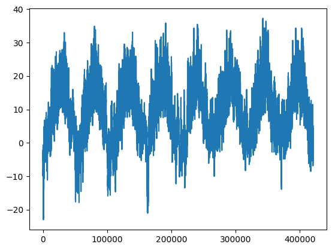
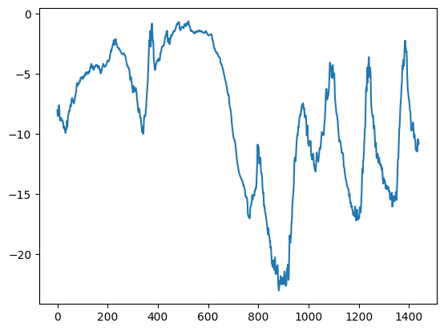
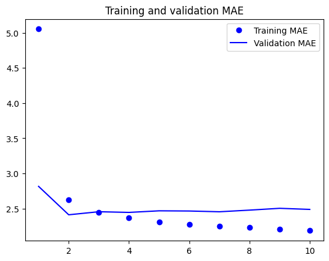
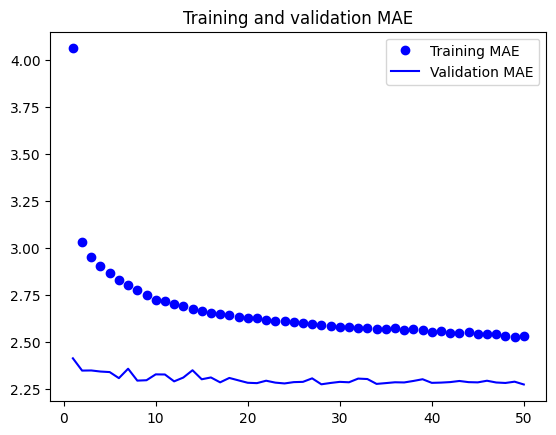

# 학습 내용

---

- 다양한 종류의 시계열 작업
- 온도 예측 문제
- 순환 신경망 이해
- 순환 신경망의 고급 사용법

---

## 다양한 종류의 시계열 작업

---

시계열 데이터?

	일정한 간격으로 측정하여 얻은 모든 데이터를 의미

		- ex) 주식의 일별 가격, 도시의 시간별 전력 소모량, 상점의 주간별 판매량 등등

	-> 시스템의 역학을 이해해야 함

시계열 관련 작업

	- 예측 -> 현시점의 시계열 데이터 다음에 일어날 것을 예측하는 것
	- 분류 -> 하나 이상의 범주형 레이블을 시계열에 부여
	- 이벤트 감지 -> 연속된 데이터 스트림에서 예상되는 특정 이벤트 발생을 식별
	- 이상치 탐지 -> 연속된 데이터 스트림에서 발생하는 비정상적인 현상을 감지

---

## 온도 예측 문제

---

문제

	건물 지붕 위의 센서에서 최근에 기록한 기압, 습도와 같은 매시간 측정값의 시계열리 주어졌을 때 

		-> 24시간 뒤의 온도를 예측하는 것

사용할 데이터

	독일 예나시에 있는 막스 플랑크 생물지구화학연구소의 기상 관측소에서 수집한 것

		-> 수년간에 걸쳐 (온도, 기압, 습도, 풍향 등) 14개의 관측치가 10분 마다 기록되어 있음

			-> 2009 ~ 2016년 사이의 데이터만 사용

데이터 다운 후 압축을 품

	'''

	!wget https://s3.amazonaws.com/keras-datasets/jena_climate_2009_2016.csv.zip
	!unzip jena_climate_2009_2016.csv.zip

	'''

예나 날씨 데이터셋 조사

	'''

	import os
	fname=os.path.join('jena_climate_2009_2016.csv')

	with open(fname) as f:
	  data=f.read()

	lines=data.split('\n')
	header=lines[0].split(',')
	lines=lines[1:]
	print(header)
	print(len(lines))

	'''

	결과: ['"Date Time"', '"p (mbar)"', '"T (degC)"', '"Tpot (K)"', '"Tdew (degC)"', '"rh (%)"', '"VPmax (mbar)"', '"VPact (mbar)"', '"VPdef (mbar)"', '"sh (g/kg)"', '"H2OC (mmol/mol)"', '"rho (g/m**3)"', '"wv (m/s)"', '"max. wv (m/s)"', '"wd (deg)"']
	     420451

		42만451줄 -> 줄마다 하나의 타임스텝

데이터 파싱

	'''

	import numpy as np

	temperature=np.zeros((len(lines),))
	raw_data=np.zeros((len(lines),len(header)-1))
	for i,line in enumerate(lines):
	  values=[float(x) for x in line.split(',')[1:]]
	  temperature[i]=values[1]
	  raw_data[i]=values[:]

	'''

	데이터 전체 -> 넘파이 배열로 바꿈

		-> 타킷: 온도 / 학습 할 데이터: 나머지 데이터(Date Time 제외)

온도 시각화

	'''

	from matplotlib import pyplot as plt
	
	plt.plot(range(len(temperature)),temperature)
	plt.show()

	'''

처음 10일간 온도 시각화

	'''

	plt.plot(range(1440),temperature[:1440])
	plt.show()

	'''

		-> 10분마다 데이터가 기록되므로  총 1440개의 데이터 포인트 존재

	-> 마지막 4일간을 살펴보면 이 10일의 기간은 아주 추운 겨울에 해당

---

데이터 탐색시 주기성을 찾아라

	- 여러 시간 범위에 걸친 주기성은 시계열 데이터에서 중요하고 매우 일반적인 성질
	- 데이터를 탐색할 때 이런 주기성을 찾아보아라

---

각 분할에 사용할 샘플 개수 계산

	'''

	num_train_samples=int(0.5*len(raw_data))
	num_val_samples=int(0.25*len(raw_data))
	num_test_samples=len(raw_data)-num_train_samples-num_val_samples
	print("num_train_samples: ",num_train_samples)
	print("num_val_samples: ",num_val_samples)
	print("num_test_samples: ",num_test_samples)

	'''
	
	결과: num_train_samples:  210225 / num_val_samples:  105112 / num_test_samples:  105114

		-> - 처음 50% 훈련 데이터

		   - 다음 25% 검증 데이터

		   - 다음 25% 테스트 데이터

---

### 데이터 준비

---

데이터 정규화

	'''

	mean=raw_data[:num_train_samples].mean(axis=0)
	raw_data-=mean
	std=raw_data[:num_train_samples].std(axis=0)
	raw_data/=std

	'''

훈련, 검증, 테스트 데이터셋 만들기

	케라스의 내장된 데이터셋 유틸리티 timeseries_data_from_array 사용

		-> 원본 시계열에서 추출한 윈도우를 제공(시퀀스(sequence)) 

			- ex) data=[0,1,2,3,4,5,6] sequence_length=3 -> [0,1,2],[1,2,3],[2,3,4],[3,4,5],[4,5,6] 샘플 생성

		-> target 매개변수로 타킷 배열을 전달해야 함

	매개변수 설정

		- sampling_rate=6 -> 시간당 하나의 데이터 포인트가 샘플링됨
		- sequence_length=120 -> 이전 5일(120시간)의 데이터 사용
		- delay=sampling_rate*(sequence_length+24-1) -> 시퀀스의 타킷은 시퀀스 끝에서 24시간 후의 온도

	'''

	sampling_rate=6
	sequence_length=120
	delay=sampling_rate*(sequence_length+24-1)
	batch_size=256

	train_dataset=keras.utils.timeseries_dataset_from_array(
	    raw_data[:-delay],
	    targets=temperature[delay:],
	    sampling_rate=sampling_rate,
	    sequence_length=sequence_length,
	    shuffle=True,
	    batch_size=batch_size,
	    start_index=0,
	    end_index=num_train_samples

	)

	val_dataset=keras.utils.timeseries_dataset_from_array(
	    raw_data[:-delay],
	    targets=temperature[delay:],
	    sampling_rate=sampling_rate,
	    sequence_length=sequence_length,
	    shuffle=True,
	    batch_size=batch_size,
	    start_index=num_train_samples,
	    end_index=num_train_samples+num_val_samples
	)

	test_dataset=keras.utils.timeseries_dataset_from_array(
	    raw_data[:-delay],
	    targets=temperature[delay:],
	    sampling_rate=sampling_rate,
	    sequence_length=sequence_length,
	    shuffle=True,
	    batch_size=batch_size,
	    start_index=num_train_samples+num_val_samples
	)

	'''

훈련 데이터셋의배치 크기 확인

	'''

	for samples,targets in train_dataset:
	  print("samples shape: ",samples.shape)
	  print("targets shape: ",targets.shape)
	  break

	'''

		-> (samples,targwts)크기의 튜플로 데이터 셋이 존재

	결과: samples shape:  (256, 120, 14) / targets shape:  (256,)

---

### 상식 수준으 ㅣ기준점

---

다음 정의된 평균 절댓값 오차(MAE) 사용

	np.mean(np.abs(preds-targets))

	'''

	def evaluate_naive_method(dataset):
	  total_abs_err=0
	  samples_seen=0
	  for samples, targets in dataset:
	    preds=samples[:,-1,-1]*std[1]+mean[1]
	    total_abs_err+=np.sum(np.abs(preds-targets))
	    samples_seen+=samples.shape[0]
	  return total_abs_err/samples_seen

	print(f"검증 MAE: {evaluate_naive_method(val_dataset):.2f}")
	print(f"테스트 MAE: {evaluate_naive_method(test_dataset):.2f}")

	'''

	결과: 검증 MAE: 9.19 / 테스트 MAE: 9.53

		-> 아주 나쁘지 않음

---

### 첫 번째 순환 신경망

---

	'''

	inputs=keras.Input(shape=(sequence_length,raw_data.shape[-1]))
	x=layers.LSTM(16)(inputs)
	outputs=layers.Dense(1)(x)
	model=keras.Model(inputs,outputs)

	callbacks = [
	    keras.callbacks.ModelCheckpoint("jena_conv.keras",
	                                    save_best_only=True)
	]
	model.compile(optimizer="rmsprop", loss="mse", metrics=["mae"])
	history = model.fit(train_dataset,
	                    epochs=10,
	                    validation_data=val_dataset,
	                    callbacks=callbacks)

	model = keras.models.load_model("jena_conv.keras")
	print(f"테스트 MAE: {model.evaluate(test_dataset)[1]:.2f}")

	loss = history.history["mae"]
	val_loss = history.history["val_mae"]
	epochs = range(1, len(loss) + 1)
	plt.figure()
	plt.plot(epochs, loss, "bo", label="Training MAE")
	plt.plot(epochs, val_loss, "b", label="Validation MAE")
	plt.title("Training and validation MAE")
	plt.legend()
	plt.show()

	'''

	결과: 테스트 MAE: 2.63

---

## 순한 신경망 이해

---

피드포워드 네트워크?

	전체 시퀀스를 하나의 데이터 포인트로 변환하는 네트워크

순환 신경망의 원리

	시퀀스의 원소를 순회하면서 지금까지 처리한 정보를 상태에 저장

RNN의 상태

	2개의 다른 다른 시퀀스를 처리하는 사이에 재설정 됨

		-> 하나의 시퀀스를 여전히 하나의 데이터 포인트, 즉 네트워크에 주입되는 하나의 입력으로 간주할 수 있음

			-> 내부적으로 시퀀스의 원소를 순회

RNN 정방향 계산 구현

	1. (timesteps,input_features)크기의 랭크-2 텐서로 인코딩된 벡터의 시퀀스를 입력 받음
	2. 타임스텝을 따라 루프를 돌면서 각 타임 스텝 t에서 현재 상태와 (크기가 (input_features,)인)입력을 연결해 출력을 계산
	3. 이 출력을 다음 스텝의 상태로 설정
		- 네트워크 초기상태 -> 0 벡터로 상태 초기화

의사 코드로 표현한 RNN

	'''

	state_t=0
	for input_t in input_sequence:
	  output_t=f(input_t,state_t)
	  state_t=output_t

	'''

		-> 시퀀스의 원소를 반복

		-> 출력은 다음 반복을 위한 상태가 됨

좀 더 자세한 의사 코드로 표현한 RNN

	'''

	state_t=0
	for input_t in input_sequence:
	  output_t=activation(dot(W,input_t)+dot(U,state_t)+b)
	  state_t=output_t

	'''

RNN의 정방향 계산 코드화

	'''

	import numpy as np

	timesteps=100
	input_features=32
	output_features=64
	inputs=np.random.random((timesteps,input_features))
	state_t=np.zeros((output_features,))

	W=np.random.random((output_features,input_features))
	U=np.random.random((output_features,output_features))
	b=np.random.random((output_features,))

	succesive_outputs=[]
	for input_t in inputs:
	  output_t=np.tanh(np.dot(W,input_t)+np.dot(U,state_t)+b)
	  succesive_outputs.append(output_t)
	  state_t=output_t
	final_output_sequence=np.stack(succesive_outputs,axis=0)

	'''

		-> tanh함수를 사용해 비선형성을 추가

스텝(step) 함수에 의해 특화됨

	- 최종 출력: (timesteps,output_features)크기의 랭크-2 텐서
	- 각 타임스텝은 시간 t에서의 출력을 나타냄
	- 출력 텐서의 각 타임스텝 t에는 입력 시퀀스에 있는 타입스텝 0에서 t까지 전체 과거에 대한 정보를 담고 있음
	- 전체 시퀀스에 대한 정보를 이미 담고 있으므로 마지막 출력(output_t)만 있으면 됨

---

### 케라스의 순환 층

---

SimpleRNN의 한 가지 다른 점?

	케라스의 다른 층과 마찬가지로 시퀀스의 배치을 처리한다는 것

		-> (batch_size,timesteps,input_features)크기의 입력을 받음

어떤 길이의 시퀀스도 처리할 수 있는 RNN 층

	'''

	num_features=14
	inputs=keras.Input(shape=(None,num_features))
	outputs=layers.SimpleRNN(16)(inputs)

	'''

		-> 시퀀스 길이가 모두 같다면 완전한 입력 크기를 지정하는 것이 좋음

케라스에 모든 순환 층은 두 가지 모드로 실행 가능

	- 각 타임스텝의 출력을 모은 전체 시퀀스((batch_size,timesteps,output_features) 크기의 랭크-3 텐서) 반환
	- 입력 시퀀스의 마지막 출력((timesteps,output_features) 크기의 랭크-2 텐서) 반환

	-> return_sequences 매개변수로 제어 가능

마지막 출력 스텝만 반환하는 RNN 층

	'''

	num_features=14
	steps=120
	inputs=keras.Input(shape=(steps,num_features))
	outputs=layers.SimpleRNN(16, return_sequences=False)(inputs)
	print(outputs.shape)

	'''

	결과: (None, 16)

전체 출력 시퀀스를 반환하는 RNN 층

	'''

	num_features=14
	steps=120
	inputs=keras.Input(shape=(steps,num_features))
	outputs=layers.SimpleRNN(16, return_sequences=True)(inputs)
	print(outputs.shape)

	'''

	결과: (None, 120, 16)

네트워크의 표현력 증가

	여러개의 순환 층을 차례로 쌓는 것이 유용할 때가 있음

		-> 이럴 때 중간층들은 전체 출력 시퀀스를 반환하도록 설정 해야함

---

SimpleRNN의 단점

	그레이데언트 소실 문제가 발생

		-> 이를 해결하기 위해 고안된 LSTM, GRU 존재

---

LSTM 층?

	정보를 여러 타임스텝에 걸처 나르는 방법이 추가 됨

		-> 나중을 위해 정보를 저장함으로써 처리 과정에서 오래된 스그널이 점차 소실되는 것(그레이디언트 소실)을 막아줌

	- 타임 스텝을 가로질러 정보를 나르는 데이터 흐름을 추가함
	- 타입 스텝 n에서 이 값을 이동 상태 c_t라고 정의 -> c는 이동을 의미
	- 이동 상태는 입력 연결과 순환 연결(상태)에 연결됨
	- 다음 타임스텝으로 전달될 상태에 영향을 미침

다음 이동 상태(c_t + 1)가 계산되는 방식

	y = activation(dot(state_t, U) + dot(input_t, W) + b)

	- 3개의 변환 모두 자신만의 가중치 행렬을 가짐
	- 각각 i,f,k로 표시

LSTM 구조의 의사 코드

	'''

	output_t = activation(c_t) * activation(dot(input_t, Wo) + dot(state_t, Uo) + bo)
	i_t = activation(dot(state_t, Ui) + dot(input_t, Wi) + bi)
	f_t = activation(dot(state_t, Uf) + dot(input_t, Wf) + bf)
	k_t = activation(dot(state_t, Uk) + dot(input_t, Wk) + bk)

	# i_t, f_t, k_t를 결합하여 새로운 이동 상태(c_t + 1)를 구함
	c_t+1 = i_t * k_t + c_t * f_t

	'''

	- c_t와 f_t의 곱셈은 이동을 위한 데이터 흐름에서 관련이 적은 정보를 의도적으로 삭제한다고 볼 수 있음(tanh 활성화 함수 사용)
	- i_t와 k_t는 현재에 대한 정보를 제공하고 이동 트랙을 새로운 정보로 업데이트(sigmoid 활성화 함수 사용)
	- RNN셀의 구조는 가설 공간을 결정
	- 셀의 구조가 셀이 하는 일을 결정하지 않음
	- RNN 셀을 구성하는 연산 조합은 엔지니어링적인 설계가 아니라 가설 공간의 제약 조건으로 해석하는 것이 나음 -> (유전 알고리즘이나 강화 학습 알고리즘 같은) 최적화 알고리즘에 맡기면 더 나아 보일 것

---

## 순환 신경망의 고급 사용법

---

	- 순환 드롭아웃 -> 드롭아웃의 한 종류로 순환 층에서 과대적합을 방지하기 위해 사용
	- 스태킹 순환 층 -> 모델의 표현 능력을 증가 , 그대신 비용이 많이 듬
	- 양방향 순환 층 -> 순환 네트워크에 같은 정보를 다른 방향으로 주입해 정확도를 높이고 기억을 좀 더 오래 유지

---

### 순환 드롭아웃

중요한 점

	- 타임스텝마다 랜덤하게 드롭아웃 마스크를 바꾸는 것이 아니라 동일한 드롭아웃 마스크(동일한 패턴으로 유닛을 드롭아웃)를 모든 타임스텝에 적용해야 함

		-> 네트워크가 학습 오차를 타임스템에 걸쳐 적절하게 전파할 수 있음

	- 케라스에 있는 모든 순환 층은 2개의 드롭아웃 매개변수를 가짐 
		- dropout은 층의 입력에 대한 드롭아웃 비율을 정하는 부동 소수점 값
		- recurrent_dropout은 순환 상태의 드롭아웃 비율을 정함

드롭아웃 규제를 적용한 LSTM 모델 훈련, 평가

	'''

	inputs=keras.Input(shape=(sequence_length,raw_data.shape[-1]))
	x=layers.LSTM(32,recurrent_dropout=0.25)(inputs)
	x=layers.Dropout(0.5)(x)
	outputs=layers.Dense(1)(x)
	model=keras.Model(inputs,outputs)

	callbacks=[
	    keras.callbacks.ModelCheckpoint("jena_lstm_dropout.keras",
	                                   save_best_only=True)
	]

	model.compile(optimizer="rmsprop",
	              loss="mse",
	              metrics=["mae"])
	history=model.fit(train_dataset,
	                  epochs=50,
	                  validation_data=val_dataset,
	                  callbacks=callbacks)

	loss = history.history["mae"]
	val_loss = history.history["val_mae"]
	epochs = range(1, len(loss) + 1)
	plt.figure()
	plt.plot(epochs, loss, "bo", label="Training MAE")
	plt.plot(epochs, val_loss, "b", label="Validation MAE")
	plt.title("Training and validation MAE")
	plt.legend()
	plt.show()

	'''

		-> Dense 층에 규제를 추가하기 위해 LSTM 층 뒤에 Dropout 층을 추가함

---

### 스태킹 순환 층

---

더 강력한 순환 네트워크를 만드는 고전적인 방법

케라스에서 순환 층을 차례로 쌓으려면?

	모든 중간층은 마지막 타임스텝 출력만 아니고 전체 시퀀스(랭크-3 텐서)를 출력해야 함

		-> return_sequences=True

드롭 아웃 규제와 스태킹을 적용한 GRU 모델 훈련, 평가

	'''

	inputs = keras.Input(shape=(sequence_length, raw_data.shape[-1]))
	x = layers.GRU(32, recurrent_dropout=0.5, return_sequences=True)(inputs)
	x = layers.GRU(32)(x)
	x = layers.Dropout(0.5)(x)
	outputs = layers.Dense(1)(x)
	model = keras.Model(inputs, outputs)

	callbacks = [
	    keras.callbacks.ModelCheckpoint("jena_stacked_gru_dropout.keras",
	                                    save_best_only=True)
	]
	model.compile(optimizer="rmsprop", loss="mse", metrics=["mae"])
	history = model.fit(train_dataset,
	                    epochs=50,
	                    validation_data=val_dataset,
	                    callbacks=callbacks)
	model = keras.models.load_model("jena_stacked_gru_dropout.keras")
	print(f"테스트 MAE: {model.evaluate(test_dataset)[1]:.2f}")

	'''

---

### 양방향 RNN

---

	기본 RNN보다 훨씬 좋은 성능을 냄

양방향 RNN의 특징

	- RNN이 순서에 민감하다는 성질 이용
	- RNN 2개를 사용해 각 RNN은 입력 시퀀스를 한 방향(시간 순서나 반대 순서)으로 처리한 후 각 표현을 합침
		- 양방향 RNN은 단방향 RNN이 놓치기 쉬운 패턴을 감지할 수 있음
	- 놀랍게도 이 절에 있는 RNN 층이 시간의 순서대로 (오래된 타임스텝이 먼저 나오도록) 시퀀스를 처리하는 것은 근거 없는 결정
	- 순서를 뒤집은 LSTM은 상식 수준의 기준점보다도 성능이 낮음
	- 텍스트 데이터셋에는 순서를 뒤집어 처리하는 것이 시간 순서대로 처리하는 것과 거의 동일하게 잘 작동
		- 언어를 이해하는 데 단어의 순서가 중요하지만 결정적이지 않음
	- 데이터를 바라보는 새로운 시각을 제공하고 다른 방식에서는 놓칠 수 있는 데이터의 특징을 잡아냄
		- 입력 시퀀스를 양쪽 방향으로 바라보기 때문에, 잠재적으로 풍부한 표현을 얻고 시간 순서대로 처리할 때 놓칠 수 있는 패턴을 감지할 수 있음

	-> 양방향 RNN 동작 방식

사용 방법

	Bidirectional 층을 사용하여 양방향 RNN을 만듦

		-> Bidirectional 클래스는 전달받은 순환 층으로 새로운 두 번째 객체를 만듦(하나는 시간 순서대로 입력 시퀀스를 처리하고, 다른 하나는 반대 순서로 입력 시퀀스를 처리)

	'''

	inputs = keras.Input(shape=(sequence_length, raw_data.shape[-1]))
	x = layers.Bidirectional(layers.LSTM(16))(inputs)
	outputs = layers.Dense(1)(x)
	model = keras.Model(inputs, outputs)

	model.compile(optimizer="rmsprop", loss="mse", metrics=["mae"])
	history = model.fit(train_dataset,
	                    epochs=10,
	                    validation_data=val_dataset)

	'''

	-> 이 모델은 평범한 LSTM 층만큼 성능이 좋지 않음

		-> 동시에 시간 반대 순서로 처리하는 층 때문에 네트워크의 용량이 2배가 되고 훨씬 더 일찍 과대적합이 시작

특징 또 한가지

	- 양방향 RNN은 텍스트 데이터 / 순서가 중요한 (하지만 사용하는 순서는 중요하지 않은) 다른 종류의 데이터에 잘 맞음
