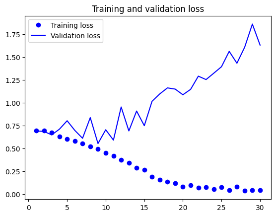
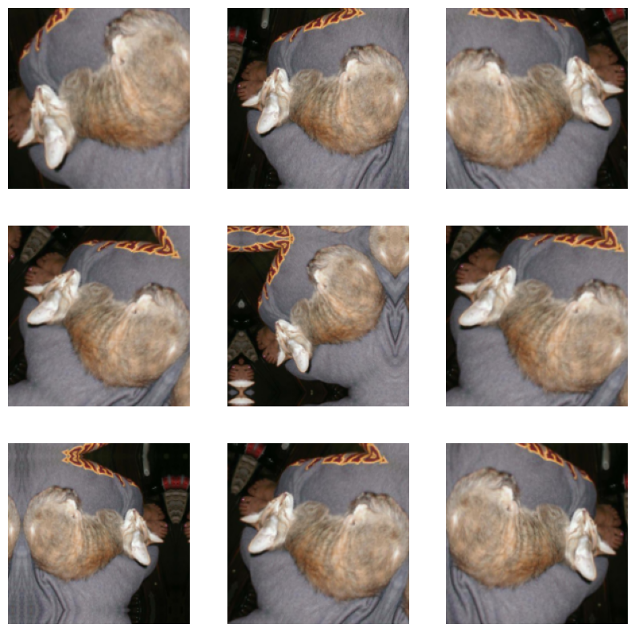
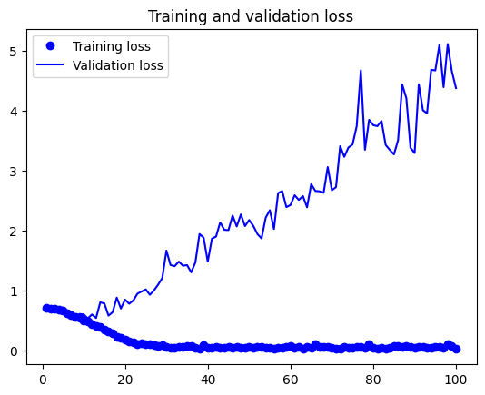
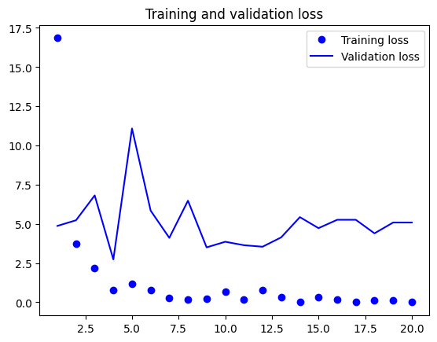
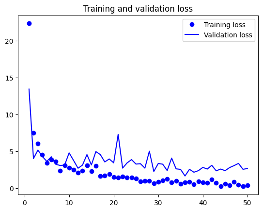

# 학습 내용

---

- 합성곱 신경망 소개
- 소규모 데이터셋에서 밑바닥부터 컨브넷 훈련
- 사전 훈련된 모델 활용

---

## 합성곱 신경망 소개

---

컨브넷 예제

	'''

	from tensorflow import keras
	from tensorflow.keras import layers

	inputs=keras.Input(shape=(28,28,1))
	x=layers.Conv2D(filters=32,kernel_size=3,activation="relu")(inputs)
	x=layers.MaxPooling2D(pool_size=2)(x)
	x=layers.Conv2D(filters=64,kernel_size=3,activation="relu")(x)
	x=layers.MaxPooling2D(pool_size=2)(x)
	x=layers.Conv2D(filters=128,kernel_size=3,activation="relu")(x)
	x=layers.Flatten()(x)
	outputs=layers.Dense(10,activation="softmax")(x)
	
	model=keras.Model(inputs=inputs,outputs=outputs)

	'''

컨브넷 입력 텐서의 크기

	배치 차원을 제외하고 (images_height,images_width,image_chennels)의 크기를 가짐

		-> 위 코드에선 mnist 이미지 포맷을 (28,28,1)크기의 입력을 처리하도록 input 설정

	'''

	model.summary()

	'''

	출력:

	'''

	Model: "functional_4"
	┏━━━━━━━━━━━━━━━━━━━━━━━━━━━━━━━━━━━━━━┳━━━━━━━━━━━━━━━━━━━━━━━━━━━━━┳━━━━━━━━━━━━━━━━━┓
	┃ Layer (type)                         ┃ Output Shape                ┃         Param # ┃
	┡━━━━━━━━━━━━━━━━━━━━━━━━━━━━━━━━━━━━━━╇━━━━━━━━━━━━━━━━━━━━━━━━━━━━━╇━━━━━━━━━━━━━━━━━┩
	│ input_layer_4 (InputLayer)           │ (None, 28, 28, 1)           │               0 │
	├──────────────────────────────────────┼─────────────────────────────┼─────────────────┤
	│ conv2d_14 (Conv2D)                   │ (None, 26, 26, 32)          │             320 │
	├──────────────────────────────────────┼─────────────────────────────┼─────────────────┤
	│ max_pooling2d_8 (MaxPooling2D)       │ (None, 13, 13, 32)          │               0 │
	├──────────────────────────────────────┼─────────────────────────────┼─────────────────┤
	│ conv2d_15 (Conv2D)                   │ (None, 11, 11, 64)          │          18,496 │
	├──────────────────────────────────────┼─────────────────────────────┼─────────────────┤
	│ max_pooling2d_9 (MaxPooling2D)       │ (None, 5, 5, 64)            │               0 │
	├──────────────────────────────────────┼─────────────────────────────┼─────────────────┤
	│ conv2d_16 (Conv2D)                   │ (None, 3, 3, 128)           │          73,856 │
	├──────────────────────────────────────┼─────────────────────────────┼─────────────────┤
	│ flatten_4 (Flatten)                  │ (None, 1152)                │               0 │
	├──────────────────────────────────────┼─────────────────────────────┼─────────────────┤
	│ dense_4 (Dense)                      │ (None, 10)                  │          11,530 │
	└──────────────────────────────────────┴─────────────────────────────┴─────────────────┘
	 Total params: 104,202 (407.04 KB)
	 Trainable params: 104,202 (407.04 KB)
	 Non-trainable params: 0 (0.00 B)

	'''

		-> 컨브넷 구조를 출력

	- Conv2D & Maxpooling2D 층의 출력 -> (height,width,channels)크기의 랭크-3 텐서
	- 높이와 너비 차원 -> 모델이 깊어질수록 작아지는 경향이 있음
	- 채널수 -> Conv2D 층에서 전달된 첫 번째 매개변수에 의해 조절
	- 마지막 Conv2D 층의출력 크기 -> (3,3,128) -> 128개의 채널을 가진 3*3 크기의 특성 맵
	- Flatten 층 -> 3D 텐서를 1D 벡터로 펼침
	- 10개의 클래스를 분류 -> 층의 출력 크기 10, softmax 활성화 함수 사용
	
mnist 이미지 컨브넷 훈련

	'''

	from tensorflow.keras.datasets import mnist

	(train_images,train_labels),(test_images,test_labels)=mnist.load_data()
	train_images=train_images.reshape((60000,28,28,1))
	train_images=train_images.astype("float32")/255
	test_images=test_images.reshape((10000,28,28,1))
	test_images=test_images.astype("float32")/255

	model.compile(optimizer="rmsprop",
	              loss="sparse_categorical_crossentropy",
	              metrics=["accuracy"])
	model.fit(train_images,train_labels,epochs=5,batch_size=64)

	test_loss,test_acc=model.evaluate(test_images,test_labels)
	print(f"테스트 정확도: {test_acc:.3f}")

	'''

	결과: 테스트 정확도: 0.989

		-> 소프트맥스 활성화 함수의 출력을 바탕으로 10대의 클래스를 분류하기 때문에 범주형 크로스엔트로피 사용

			-> 레이블이 정수이므로 sparse_categorical_crossentropy 사용

---

### 합성곱 연산

---

완전 연경 층, 합성곱 층 사이의 근본적인 차이

	- Dense층 -> 입력 특성 공간에 있는 전역 패턴(모든 픽셀에 걸친 패턴)을 학습
	- 합성곱 층 -> 지역 패턴(2D 윈도우로 입력에서 패턴을 찾음)을 학습

	-> 이미지는 에지(edge),질감(texture)등 지역 패턴으로 분해될 수 있음

컨브넷의 두 가지 흥미로운 성질

	- 학습된 패턴은 평행 이동 불변성을 가짐

		-> 컨브넷이 이미지의 오른쪽 아래 모서리에서 어떤 패턴을 학습 했다면 다른곳(왼쪽 위 모서리)에서도 이 패턴을 인식 가능

			-> 컨브넷이 이미지를 효율적으로 처리하게 만들어 줌

	- 컨브넷은 패턴의 공간적 계층 구조를 학습할 수 있음

		-> 첫 번째 합성곱 층이 에지 같은 작은 지역 패턴 학습
		   두 번째 합성곱 층은 첫 번째 층의 특성으로 구성된 더 큰 패턴을 학습

			-> 컨브넷은 매우 복잡하고 추상적인 시각적 개념을 효과적으로 학습 가능

				-> 근본적으로 우리가 보는 세상은 공간적 계층 구조를 가짐

합성곱 연산

	특성 맵이라고 부르는 랭크-3 텐서에 적용

		-> 이 텐서는 2개의 공간 축 (높이와 넓이)돠 깊이 축(채널 축)으로 구성

	-> 입력 특성 맵에서 작은 패치들을 추출, 이런 패치에 같은 변환을 출력 특성 맵을 만듦

출력 텐서의 깊이

	매개변수로 결정되기 때문에 상황에 따라 다름

		-> 깊이 축의 채널은 더이상 RGB 입력처럼 특정 컬러를 의미 X 

			-> 그 대신 일종의 필터를 의미

필터?

	입력 데이터의 어떤 튿성을 인코딩

		-> 고수준으로 보면 하나의 필터가 '입력에 얼굴이 있는지'를 인코딩할 수 있음

필터의 응답 맵

	위 mnist 예제에서 첫 번째 합성곱 층에서 (28,28,1) -> (26,26,32) 크기가 변환

		-> 입력에 대해 32개의 필터가 적용

			->(26,26,32) 이 값은 입력에 대한 필터의 응답 맵

특성 맵?

	깊이 축에 있는 각 차원은 하나의 특성이고, 랭크-2 텐서인 ouput은 입력에 대한 이 필터 응답을 나타내는 2D 공간상의 맵

핵심적인 2개의 파라미터로 정의되는 합성곱

	- 입력으로부터 뽑아낼 패치의 크기

		-> 전형적으로 3*3 / 5*5 크기를 사용

	- 특성 맵의 출력 깊이

		-> 합성곱으로 계산할 필터의 개수(32 -> 128)

합성곱의 작동 방식

	1. 3D 특성 맵 위를 3*3 / 5*5 크기의 윈도우가 슬라이싱 하면서 모든 위치에서 3D 특성 패치((window_height,window_width,window_depth) 크기)를 추출
	2. 합성곱 커널이라고 불리는 하나의 학습된 가중치 행렬과의 텐서 곱셈을 통해 (output_depth,)크기의 1D 벡터로 변환
	3. 동일한 커널이 모든 패치에 걸쳐서 1D 벡터로 변환
	4. 변환된 모든 벡터(height,widht,output_depth) 크기의 3D 특성 맵으로 재구성됨 -> 출력 특성 맵은 입력 특성 맵의 같은 위치에 대응

ex)

	3*3 윈도우를 사용하면 3D 패치 input[i+1 : i+2, j+1 : j+2, :]로부터 벡터 output[i, j, :]가 만들어짐

출력 높이, 넓이 != 입력의 높이, 너비

	- 경계 문제, 입력 특성 맵에 패딩을 추가해 대응 가능
	- 스트라이드의 사용 여부에 따라 다름

---

경계 문제와 패딩 이해

ex) 5*5 특성 맵 / 3*3 필터

	경계 문제 (5*5 -> 3*3)

동일한 높이와 너비를 가진 출력 특성 맵을 얻고 싶다?

	패딩 사용

패딩?

	입력 특성 맵의 가장자리에 적절한 개수의 행과 열을 추가

		-> 모든 입력 타일에 합성곱 윈도우의 중앙을 위치시킬 수 있음

	- 3*3 윈도우 -> 위, 아래에 하나의 행을 오른쪽, 왼쪽에 하나의 열을 추가
	- 5*5 윈도우 -> 두 개의 행과 열 추가

패딩 설정

	Conv2D 층에서 패딩 -> padding 매개변수로 설정 가능

	- valid -> 패딩 사용 X
	- same -> 입력과 동일한 높이와 너비를 가지 출력을 만들기 위한 패딩

		-> 기본값은 valid

---

합성곱 스트라이드 이해

스트라이드?

	두 번의 연속적인 윈도우 사이의 거리

기본값

	1

ex)

	-> 5*5 크기의 입력에 스트라이드 2를 사용한 3*3 크기의 윈도우 합성곱

		-> 스트라이드 2 -> 특성 맵의 넓이와 높이가 2의 배수로 다운샘플링됨

분류 모델의 다운샘플링

	최대풀링(maxpooling)연산을 사용하는 경우가 많음

---

### 최대 풀링 연산

---

최대 풀링?

	입력 특성 맵에서 윈도우에 맞는 패치를 추출, 각 채널별로 최댓값을 출력

		-> 하드코딩된 최댓값 추출 연산을 사용

역할

	강제적으로 특성 맵을 다운샘플링하는 것

합성곱과 가장 큰 차이점

	- 최대 풀링 -> 보통 2*2 윈도우, 스트라이드 2를 사용해 특성 맵을 절반 크기로 다운 샘플링
	- 합성곱 -> 전형적인 3*3 윈도우, 스트라이드 1 사용

	'''

	inputs=keras.Input(shape=(28,28,1))
	x=layers.Conv2D(filters=32,kernel_size=3,activation="relu")(inputs)
	x=layers.Conv2D(filters=64,kernel_size=3,activation="relu")(x)
	x=layers.Conv2D(filters=128,kernel_size=3,activation="relu")(x)
	x=layers.Flatten()(x)
	outputs=layers.Dense(10,activation="softmax")(x)
	model_no_max_pool=keras.Model(inputs=inputs,outputs=outputs)
	model_no_max_pool.summary()

	'''
	
	결과:

	'''

	Model: "functional_5"
	┏━━━━━━━━━━━━━━━━━━━━━━━━━━━━━━━━━━━━━━┳━━━━━━━━━━━━━━━━━━━━━━━━━━━━━┳━━━━━━━━━━━━━━━━━┓
	┃ Layer (type)                         ┃ Output Shape                ┃         Param # ┃
	┡━━━━━━━━━━━━━━━━━━━━━━━━━━━━━━━━━━━━━━╇━━━━━━━━━━━━━━━━━━━━━━━━━━━━━╇━━━━━━━━━━━━━━━━━┩
	│ input_layer_5 (InputLayer)           │ (None, 28, 28, 1)           │               0 │
	├──────────────────────────────────────┼─────────────────────────────┼─────────────────┤
	│ conv2d_17 (Conv2D)                   │ (None, 26, 26, 32)          │             320 │
	├──────────────────────────────────────┼─────────────────────────────┼─────────────────┤
	│ conv2d_18 (Conv2D)                   │ (None, 24, 24, 64)          │          18,496 │
	├──────────────────────────────────────┼─────────────────────────────┼─────────────────┤
	│ conv2d_19 (Conv2D)                   │ (None, 22, 22, 128)         │          73,856 │
	├──────────────────────────────────────┼─────────────────────────────┼─────────────────┤
	│ flatten_5 (Flatten)                  │ (None, 61952)               │               0 │
	├──────────────────────────────────────┼─────────────────────────────┼─────────────────┤
	│ dense_5 (Dense)                      │ (None, 10)                  │         619,530 │
	└──────────────────────────────────────┴─────────────────────────────┴─────────────────┘
	 Total params: 712,202 (2.72 MB)
	 Trainable params: 712,202 (2.72 MB)
	 Non-trainable params: 0 (0.00 B)

	'''

		-> 최대 풀링 층이 빠진 컨브넷

두가지 문제 발생

	- 특성의 공간적 계층 구조를 학습하는 데 도움이 되지 않음

		-> 세 번째 층의 3*3 윈도우는 초기 입력의 7*7 윈도우 영역에 대한 정보만 담고 있음

			-> 초기 입력에 관한 정보가 아주 적어 숫자 분류를 학습하기에 충분 X

	- 너무 많은 가중치를 가짐

		-> 심각한 과재적합이 발생할 것

다운샘플링을 사용하는 이유

	- 특성 맵의 가중치 개수를 줄이기 위함
	- 연속적인 합성곱 층이 (원본 입력에서 커버되는 영역 측면에서) 점점 커진 윈도우를 통해 바라보도록 만듦 -> 필터의 공간적인 계층 구조를 구성

다운샘플링 다른 방법

	평균 풀링도 있음

		-> 보통은 최대 풀링이 더 잘 작동

			-> 특성이 특성 맵의 각 타일에서 어떤 패턴이나 개념의 존재 여부를 인코딩하는 경향이 있기 때문

---

## 소규모 데이터셋에서 밑바닥부터 컨브넷 훈련

---

매우 적은 데이터(보통 수백 개 ~ 수만 개)를 사용해 이미지 분류 모델을 훈련하는 일은 흔함

소규모 데이터셋을 사용해 처음부터 새로운 모델을 훈련

	약 70% 분류 정확도 달성

		-> 과재적합 이슈

해결책

	데이터 증식

		-> 80 ~ 85 정확도로 향상 가능

---

### 작은 데이터셋 문제에서 딥러닝의 타당성

---

복잡한 문제를 푸는 컨브넷

	-> 수십 개의 샘플만 사용해 훈련 불가

모델이 규제가 잘 되어 있으며 간단한 작업

	-> 수백 개의 샘플로도 충분할 수 있음

---

### 데이터 내려받기

---

여기에서 사용할 강아지 vs 고양이 데이터셋(Dogs vs Cats dataset)

	-> 케라스에 포함되어 있지 않음

코렙에서 데이터 내려받기

1. 먼저 캐글 API키를 만들어 로컬 컴퓨터로 내려받아야 함
	- 웹 브러우저로 캐글 웹 사이트에 접속하여 로그인한 후 Account 페이지로 이동
	- API 섹션을 찾음
	- 그다음 Create New API Token 버튼을 누리면 kaggle.json 파일이 생성되고 컴퓨터로 내려받기 됨
2. 그다음 코랩 노트북으로 이동한 후 셀에서 다음 명령을 실행하여 API키가 담긴 JSON 파일을 현재 코랩 세션(session)에 업로드

	'''

	# kaggle.json 파일을 업로드하세요.
	from google.colab import files		-> 이 셀을 실행하면 파일 선택 버튼이 나타남. 버튼을 누르고 방금 전에 내려받은 kaggle.json 파일을 선택. 그러면 이 파일이 현재 코랩 런타임에 업로드
	files.upload()

	'''

3. 마지막으로 ~/.kaggle 폴더를 만들고(mkdir ~/.kaggle) 키 파일을 이 폴더로 복사(cp kaggle.json ~/.kaggle/). 보안을 위해 현재 사용자만 이 파일을 읽을 수 있게 함(chmod 600)

	'''

	!mkdir ~/.kaggle
	!cp kaggle.json ~/.kaggle/
	!chmod 600 ~/.kaggle/kaggle.json

	'''

	- 데이터를 처음 내려받을 때 '403 Forbidden' 에러가 발생할 수 있음
	- 데이터를 내려받기 전에 이 데이터셋에 연관된 규칙에 동의해야 하기 때문임
	- (캐글 계정에 로그인한 상태에서) www.kaggle.com/c/dogs-vs-cats/rules 페이지로 이동한 후 I Understand and Accept 버튼을 누름
	- 약관 동의는 한 번만 하면 됨

	'''

	!kaggle competitions download -c dogs-vs-cats		-> 사용할 데이터를 내려받기

	'''

4. 훈련 데이터는 dogs-vs-cats.zip 이름의 압축 파일
	- 이 파일의 압축을 해제한 후 생성된 train.zip 파일의 압축도 품
	- 압축 해제할 때(unzip) 메시지가 출력되지 않도록 옵션을 추가(-qq)

	'''

	!unzip -qq dogs-vs-cats.zip
	!unzip -qq train.zip

	'''

데이터셋 크기

	-> 2만 5,000개의 강아지와 고양이(클래스마다 1만 2,500개), 543MB 크기

데이터셋 크기 지정

	- 클래스마다 1,000개의 샘플 -> 훈련셋
	- 클래스마다 500개의 샘플 -> 검증셋
	- 클래스마다 1,000개의 샘플 -> 테스트셋

shutil 패키지를 사용해 위와 같은 구조 생성

	'''
	
	import os,shutil,pathlib

	original_dir=pathlib.Path("train")
	new_base_dir=pathlib.Path("cats_vs_dogs_small")
	def make_subset(subset_name,start_index,end_index):
	  for category in("cat","dog"):
	    dir=new_base_dir/subset_name/category
	    os.makedirs(dir)
	    fnames=[f"{category}.{i}.jpg" for i in range(start_index,end_index)]
	    for fname in fnames:
	      shutil.copyfile(src=original_dir/fname,dst=dir/fname)

	make_subset("train",start_index=0,end_index=1000)
	make_subset("validation",start_index=1000,end_index=1500)
	make_subset("test",start_index=1500,end_index=2500)

	'''

---

### 모델 만들기

이진 분류 문제

	마지막 층 -> 하나의 유닛, sigmoid 활성화 함수 사용

Rescaling 층?

	스케일 변환해주는 층([0,255] -> [0,1])
	
	'''

	from tensorflow import keras
	from tensorflow.keras import layers

	inputs=keras.Input(shape=(180,180,3))
	x=layers.Rescaling(1./255)(inputs)
	x=layers.Conv2D(filters=32,kernel_size=3,activation="relu")(x)
	x=layers.MaxPooling2D(pool_size=2)(x)
	x=layers.Conv2D(filters=64,kernel_size=3,activation="relu")(x)
	x=layers.MaxPooling2D(pool_size=2)(x)
	x=layers.Conv2D(filters=128,kernel_size=3,activation="relu")(x)
	x=layers.MaxPooling2D(pool_size=2)(x)
	x=layers.Conv2D(filters=256,kernel_size=3,activation="relu")(x)
	x=layers.MaxPooling2D(pool_size=2)(x)
	x=layers.Conv2D(filters=256,kernel_size=3,activation="relu")(x)
	x=layers.Flatten()(x)
	outputs=layers.Dense(1,activation="sigmoid")(x)
	model=keras.Model(inputs=inputs,outputs=outputs)

	model.summary()

	model.compile(optimizer="rmsprop",
              loss="binary_crossentropy",
              metrics=["accuracy"])

	'''

	결과:

	'''

	Model: "functional_7"
	┏━━━━━━━━━━━━━━━━━━━━━━━━━━━━━━━━━━━━━━┳━━━━━━━━━━━━━━━━━━━━━━━━━━━━━┳━━━━━━━━━━━━━━━━━┓
	┃ Layer (type)                         ┃ Output Shape                ┃         Param # ┃
	┡━━━━━━━━━━━━━━━━━━━━━━━━━━━━━━━━━━━━━━╇━━━━━━━━━━━━━━━━━━━━━━━━━━━━━╇━━━━━━━━━━━━━━━━━┩
	│ input_layer_7 (InputLayer)           │ (None, 180, 180, 3)         │               0 │
	├──────────────────────────────────────┼─────────────────────────────┼─────────────────┤
	│ rescaling_2 (Rescaling)              │ (None, 180, 180, 3)         │               0 │
	├──────────────────────────────────────┼─────────────────────────────┼─────────────────┤
	│ conv2d_25 (Conv2D)                   │ (None, 178, 178, 32)        │             896 │
	├──────────────────────────────────────┼─────────────────────────────┼─────────────────┤
	│ max_pooling2d_14 (MaxPooling2D)      │ (None, 89, 89, 32)          │               0 │
	├──────────────────────────────────────┼─────────────────────────────┼─────────────────┤
	│ conv2d_26 (Conv2D)                   │ (None, 87, 87, 64)          │          18,496 │
	├──────────────────────────────────────┼─────────────────────────────┼─────────────────┤
	│ max_pooling2d_15 (MaxPooling2D)      │ (None, 43, 43, 64)          │               0 │
	├──────────────────────────────────────┼─────────────────────────────┼─────────────────┤
	│ conv2d_27 (Conv2D)                   │ (None, 41, 41, 128)         │          73,856 │
	├──────────────────────────────────────┼─────────────────────────────┼─────────────────┤
	│ max_pooling2d_16 (MaxPooling2D)      │ (None, 20, 20, 128)         │               0 │
	├──────────────────────────────────────┼─────────────────────────────┼─────────────────┤
	│ conv2d_28 (Conv2D)                   │ (None, 18, 18, 256)         │         295,168 │
	├──────────────────────────────────────┼─────────────────────────────┼─────────────────┤
	│ max_pooling2d_17 (MaxPooling2D)      │ (None, 9, 9, 256)           │               0 │
	├──────────────────────────────────────┼─────────────────────────────┼─────────────────┤
	│ conv2d_29 (Conv2D)                   │ (None, 7, 7, 256)           │         590,080 │
	├──────────────────────────────────────┼─────────────────────────────┼─────────────────┤
	│ flatten_7 (Flatten)                  │ (None, 12544)               │               0 │
	├──────────────────────────────────────┼─────────────────────────────┼─────────────────┤
	│ dense_7 (Dense)                      │ (None, 1)                   │          12,545 │
	└──────────────────────────────────────┴─────────────────────────────┴─────────────────┘
	 Total params: 991,041 (3.78 MB)
	 Trainable params: 991,041 (3.78 MB)
	 Non-trainable params: 0 (0.00 B)
	
	'''

		-> 옵티마이저는 RMSprop 선택, 손실은 모델의 마지막 층이 sigmoid 유닛이기 때문에 이진 크로스엔트로피(binary crossentropy) 사용

---

### 데이터 전처리

---

데이터는 네트워크에 주입되기 전에 부동 소수점 타입의 텐서로 전처리되어 있어야 함

JPEG 이미지 전처리 과정

	1. 사진 파일을 읽음
	2. JPEG 콘텐츠를 RGB 픽셀 값으로 디코딩
	3. 부동 수소점 타입의 텐서로 변환
	4. 동일한 크기의 이미지로 바꿈(여기선 180*180)
	5. 배치로 묶음(하나의 배치 -> 32개의 이미지로 구성)

		-> 케라스의 image_dataset_from_dirctory() 함수 제공

image_dataset_from_dirctory() 호출

	1. dirctory의 서브디렉터리를 찾음
	2. 서브디렉터리(한 클래스에 해당하는 이미지가 담겨 있다고 가정)에 있는 이미지 파일을 인덱싱
	3. tf. data.Dataset 객체를 만들어 반환

텐서플로 Dataset 객체 이해

	- 텐서플로는 머신 러닝 모델을 위한 효율적인 입력 파이프라인을 만들 수 있는 tf.data API를 제공
	- 핵심 클래스는 tf.data.Dataset
	- Dataset 객체는 반복자(iterator)
	- 즉, for 루프에 사용할 수 있으며 일반적으로 입력 데이터와 레이블의 배치를 반환
	- Dataset 객체를 바로 케라스 모델의 fit() 메서드에 전달할 수 있음
	- Dataset 클래스는 직접 구현하기 어려운 여러 가지 핵심 기능을 처리해 줌
	- 특히 비동기 데이터 프리페칭(prefetching)(이전 배치를 모델이 처리하는 동안 다음 배치 데이터를 전처리하기 때문에 중단 없이 모델을 계속 실행할 수 있음)

이미지 읽는 코드 작성

	'''

	from tensorflow.keras.utils import image_dataset_from_directory

	train_dataset=image_dataset_from_directory(
	  new_base_dir/"train",
	  image_size=(180,180),
	  batch_size=32
	)
	validation_dataset=image_dataset_from_directory(
	  new_base_dir/"validation",
	  image_size=(180,180),
	  batch_size=32
	)
	test_dataset=image_dataset_from_directory(
	  new_base_dir/"test",
	  image_size=(180,180),
	  batch_size=32
	)

	'''

		-> image_dataset_from_dirctory() 사용

	'''

	for data_batch,labels_batch in train_dataset:
	  print("배치 데이터 크기:",data_batch.shape)
	  print("배치 레이블 크기:",labels_batch.shape)
	  break

	'''

	결과: 배치 데이터 크기: (32, 180, 180, 3) / 배치 레이블 크기: (32,)

모델 훈련

	'''

	callbacks=[
	    keras.callbacks.ModelCheckpoint(
	        filepath="convent_from_scratch.keras",
	        save_best_only=True,
	        monitor="val_loss")
	]

	history=model.fit(train_dataset,
	                  epochs=30,
	                  validation_data=validation_dataset,
	                  callbacks=callbacks)

	import matplotlib.pyplot as plt

	accuracy=history.history["accuracy"]
	val_accuracy=history.history["val_accuracy"]
	loss=history.history["loss"]
	val_loss=history.history["val_loss"]
	epochs=range(1,len(accuracy)+1)

	plt.plot(epochs,accuracy,"bo",label="Training accuracy")
	plt.plot(epochs,val_accuracy,"b",label="Validation accuracy")
	plt.title("Trainin and validation accuracy")
	plt.legend()
	plt.figure()

	plt.plot(epochs,loss,"bo",label="Training loss")
	plt.plot(epochs,val_loss,"b",label="Validation loss")
	plt.title("Training and validation loss")
	plt.legend()
	plt.show()

	'''

		-> ModelCheckpoint 콜백 사용(sace_best_only=True, moniter="val_loss")

	-> 과대적합

	'''
	
	test_model=keras.models.load_model("convent_from_scratch.keras")
	test_loss,test_acc=test_model.evaluate(test_dataset)
	print(f"테스트 정확도: {test_acc:.3f}")

	'''

		-> 테스트 정확도 69.5%을 얻음

---

### 데이터 증식 사용하기

---

데이터 증식?

	기존 훈련 샘플로부터 더 많은 훈련 데이테를 생성하는 방법

		-> 그럴듯한  이미지를 생성하도록 여러가지 랜덤한 변환을 적용하여 샘플을 늘림

사용 방법

	모델 시작 부분에 여러개의 데이터 증식 층을 추가 가능

코드화

	'''

	data_augmentation=keras.Sequential(
	    [
	    layers.RandomFlip("horizontal"),
	    layers.RandomRotation(0.1),
	    layers.RandomZoom(0.2),
	    ]
	)

	'''

		- RandomFlip("horizontal") -> 랜덤하게 50% 이미지를 수평으로 뒤집음
		
		- RandomRotation(0,1) -> [-10%, +10%] 범위 안에서 랜덤한 값만큼 입력 이미지 회전

		- RandomZoom(0,2) -> [-20%. 20%] 범위 안에서 램덤한 비율만큼 이미지를 확대 / 축소

증식된 이미지 확인

	'''

	plt.figure(figsize=(10,10))
	for images,_ in train_dataset.take(1):
	  for i in range(9):
	    augmented_images=data_augmentation(images)
	    ax=plt.subplot(3,3,i+1)
	    plt.imshow(augmented_images[0].numpy().astype("uint8"))
	    plt.axis("off")

	'''

단점

	- 새로운 정보를 만들어 낼 수 없음
	- 단지 기존 정보의 재조합만 가능
	- 완전히 과대적합을 제거하기에 충분하지 않을 수 있음

알아야 할 한가지

	- Dropout 층처럼 추론할 때는 동작 X

		-> 모델을 평가할 때는 데이터 증식 / Dropout이 없는 모델처럼 동작

---

데이터 증식 사용

	'''

	inputs=keras.Input(shape=(180,180,3))
	x=layers.Rescaling(1./255)(inputs)
	x=layers.Conv2D(filters=32,kernel_size=3,activation="relu")(x)
	x=layers.MaxPooling2D(pool_size=2)(x)
	x=layers.Conv2D(filters=64,kernel_size=3,activation="relu")(x)
	x=layers.MaxPooling2D(pool_size=2)(x)
	x=layers.Conv2D(filters=128,kernel_size=3,activation="relu")(x)
	x=layers.MaxPooling2D(pool_size=2)(x)
	x=layers.Conv2D(filters=256,kernel_size=3,activation="relu")(x)
	x=layers.MaxPooling2D(pool_size=2)(x)
	x=layers.Conv2D(filters=256,kernel_size=3,activation="relu")(x)
	x=layers.Flatten()(x)
	x=layers.Dropout(0.5)(x)
	outputs=layers.Dense(1,activation="sigmoid")(x)
	model=keras.Model(inputs=inputs,outputs=outputs)

	model.compile(optimizer="rmsprop",
	              loss="binary_crossentropy",
	              metrics=["accuracy"])

	callbacks=[
	    keras.callbacks.ModelCheckpoint(
	        filepath="convent_from_scratch_with_augmentation.keras",
	        save_best_only=True,
	        monitor="val_loss")
	]

	history=model.fit(train_dataset,
	                  epochs=100,
	                  validation_data=validation_dataset,
	                  callbacks=callbacks)

	import matplotlib.pyplot as plt

	accuracy=history.history["accuracy"]
	val_accuracy=history.history["val_accuracy"]
	loss=history.history["loss"]
	val_loss=history.history["val_loss"]
	epochs=range(1,len(accuracy)+1)

	plt.plot(epochs,accuracy,"bo",label="Training accuracy")
	plt.plot(epochs,val_accuracy,"b",label="Validation accuracy")
	plt.title("Trainin and validation accuracy")
	plt.legend()
	plt.figure()

	plt.plot(epochs,loss,"bo",label="Training loss")
	plt.plot(epochs,val_loss,"b",label="Validation loss")
	plt.title("Training and validation loss")
	plt.legend()
	plt.show()

	'''

	'''

	test_model=keras.models.load_model("convent_from_scratch_with_augmentation.keras")
	test_loss,test_acc=test_model.evaluate(test_dataset)
	print(f"테스트 정확도: {test_acc:.3f}")

	'''

		-> 테스트 정확도 83.5%를 얻음

---

## 사전 훈련된 모델 활용

---

사전 훈련된 모델?

	일반적으로 대규모 이미지 분류 문제를 위해 대량의 데이터셋에서 이미 훈련된 모델

		-> 원본 데이터셋이 충분히 크고 일반적이라면 사전 훈련된 모델에 의해 학습된 특성의 계층 구조는 실제 세상에 대한 일반적인 모델로 효율적인 역할을 할 수 있음

딥러닝의 핵심 장점

	학습된 특성을 다른 문제에 적용할 수 있는 이런 유연성

사전 훈련된 모델을 사용하는 두 가지 방법

	- 특성 추출
	- 미세 조정

---

### 사전 훈련된 모델을 사용한 특성 추출

특성 추출 

	사전에 학습된 모델의 표현을 사용해 새로운 샘플에서 흥미로운 특성을 뽑아내는 것

컨브넷 이미지 분류를 위해 두 부분 구성

	- 합성곱과 풀링 층(합성곱 기반 층)
	- 밀집 연결 분류기

특정 합성곱 층 추출한 표현의 일반성 수준

	-> 모델에 있는 층의 깊이에 달려있음

	모델의 하위 층

		-> (에지,색깔,질감 등) 지역적이고 매우 일반적인 특성 맵을 추출

	모델의 상위 층

		-> ('강아지 눈', '고양이 귀') 좀 더 추상적인 개념을 추출

	∴ 모델의 하위 층 몇개만 특성 추출에 사용하는 것이 좋음

---

VGG16 합성곱 기반 층 생성

	'''

	conv_base=keras.applications.vgg16.VGG16(
	    weights="imagenet",
	    include_top=False,
	    input_shape=(180,180,3)
	)

	'''

	매개변수 3개

		- weights -> 모델을 초기화할 가중치 체크포인트 지정

		- include_top -> 네트워크 맨 위에 놓인 밀집 연결 분류기를 포함할지 안 할지 지정

		- input_shape -> 네트워크에 주입할 이미지 텐서의 크기(선택 사항)

	'''

	conv_base.summary()

	'''

	결과:

	'''

	Model: "vgg16"
	┏━━━━━━━━━━━━━━━━━━━━━━━━━━━━━━━━━━━━━━┳━━━━━━━━━━━━━━━━━━━━━━━━━━━━━┳━━━━━━━━━━━━━━━━━┓
	┃ Layer (type)                         ┃ Output Shape                ┃         Param # ┃
	┡━━━━━━━━━━━━━━━━━━━━━━━━━━━━━━━━━━━━━━╇━━━━━━━━━━━━━━━━━━━━━━━━━━━━━╇━━━━━━━━━━━━━━━━━┩
	│ input_layer_10 (InputLayer)          │ (None, 180, 180, 3)         │               0 │
	├──────────────────────────────────────┼─────────────────────────────┼─────────────────┤
	│ block1_conv1 (Conv2D)                │ (None, 180, 180, 64)        │           1,792 │
	├──────────────────────────────────────┼─────────────────────────────┼─────────────────┤
	│ block1_conv2 (Conv2D)                │ (None, 180, 180, 64)        │          36,928 │
	├──────────────────────────────────────┼─────────────────────────────┼─────────────────┤
	│ block1_pool (MaxPooling2D)           │ (None, 90, 90, 64)          │               0 │
	├──────────────────────────────────────┼─────────────────────────────┼─────────────────┤
		│ block2_conv1 (Conv2D)                │ (None, 90, 90, 128)         │          73,856 │
	├──────────────────────────────────────┼─────────────────────────────┼─────────────────┤
	│ block2_conv2 (Conv2D)                │ (None, 90, 90, 128)         │         147,584 │
	├──────────────────────────────────────┼─────────────────────────────┼─────────────────┤
	│ block2_pool (MaxPooling2D)           │ (None, 45, 45, 128)         │               0 │
	├──────────────────────────────────────┼─────────────────────────────┼─────────────────┤
	│ block3_conv1 (Conv2D)                │ (None, 45, 45, 256)         │         295,168 │
	├──────────────────────────────────────┼─────────────────────────────┼─────────────────┤
	│ block3_conv2 (Conv2D)                │ (None, 45, 45, 256)         │         590,080 │
	├──────────────────────────────────────┼─────────────────────────────┼─────────────────┤
	│ block3_conv3 (Conv2D)                │ (None, 45, 45, 256)         │         590,080 │
	├──────────────────────────────────────┼─────────────────────────────┼─────────────────┤
	│ block3_pool (MaxPooling2D)           │ (None, 22, 22, 256)         │               0 │
	├──────────────────────────────────────┼─────────────────────────────┼─────────────────┤
	│ block4_conv1 (Conv2D)                │ (None, 22, 22, 512)         │       1,180,160 │
	├──────────────────────────────────────┼─────────────────────────────┼─────────────────┤
	│ block4_conv2 (Conv2D)                │ (None, 22, 22, 512)         │       2,359,808 │
	├──────────────────────────────────────┼─────────────────────────────┼─────────────────┤
	│ block4_conv3 (Conv2D)                │ (None, 22, 22, 512)         │       2,359,808 │
	├──────────────────────────────────────┼─────────────────────────────┼─────────────────┤
	│ block4_pool (MaxPooling2D)           │ (None, 11, 11, 512)         │               0 │
	├──────────────────────────────────────┼─────────────────────────────┼─────────────────┤
	│ block5_conv1 (Conv2D)                │ (None, 11, 11, 512)         │       2,359,808 │
	├──────────────────────────────────────┼─────────────────────────────┼─────────────────┤
	│ block5_conv2 (Conv2D)                │ (None, 11, 11, 512)         │       2,359,808 │
	├──────────────────────────────────────┼─────────────────────────────┼─────────────────┤
	│ block5_conv3 (Conv2D)                │ (None, 11, 11, 512)         │       2,359,808 │
	├──────────────────────────────────────┼─────────────────────────────┼─────────────────┤
	│ block5_pool (MaxPooling2D)           │ (None, 5, 5, 512)           │               0 │
	└──────────────────────────────────────┴─────────────────────────────┴─────────────────┘
	 Total params: 14,714,688 (56.13 MB)
	 Trainable params: 14,714,688 (56.13 MB)
	 Non-trainable params: 0 (0.00 B)

	'''

		-> 자세한 구조

밀집 연결 층을 놓는 방법 두 가지 방법

	- 새로운 데이터셋에서 합성곱 기반 층을 실행하도 출력을 넘파이 배열로 디스크에 저장
	- 준비한 모델 위에 Dense 층을 쌓아 확장 -> 전체 모델 실행

---

데이터 증식을 사용하지 않는 빠른 특성 추출

	'''

	import numpy as np

	def get_features_and_labels(dataset):
	  all_features=[]
	  all_labels=[]
	  for images,labels in dataset:
	    preprocessed_images=keras.applications.vgg16.preprocess_input(images)
	    features=conv_base.predict(preprocessed_images)
	    all_features.append(features)
	    all_labels.append(labels)
	  return np.concatenate(all_features),np.concatenate(all_labels)

	train_features,trina_labels=get_features_and_labels(train_dataset)
	val_features,val_labels=get_features_and_labels(validation_dataset)
	test_features,test_labels=get_features_and_labels(test_dataset)

	'''

		-> VGG16 특성과 해당 레이블 추출

	'''

	inputs=keras.Input(shape=(5,5,512))
	x=layers.Flatten()(inputs)
	x=layers.Dense(256)(x)
	x=layers.Dropout(0.5)(x)
	outputs=layers.Dense(1,activation="sigmoid")(x)

	model=keras.Model(inputs,outputs)
	model.compile(optimizer="rmsprop",
	              loss="binary_crossentropy",
	              metrics=["accuracy"]
	              )

	callbacks=[
	    keras.callbacks.ModelCheckpoint(
	        filepath="feature_extraction.keras",
	        save_best_only=True,
	        monitor="val_loss"
	    )
	]

	history=model.fit(train_features,trina_labels,
	                  epochs=20,
	                  validation_data=(val_features,val_labels),
	                  callbacks=callbacks)

	import matplotlib.pyplot as plt

	accuracy=history.history["accuracy"]
	val_accuracy=history.history["val_accuracy"]
	loss=history.history["loss"]
	val_loss=history.history["val_loss"]
	epochs=range(1,len(accuracy)+1)

	plt.plot(epochs,accuracy,"bo",label="Training accuracy")
	plt.plot(epochs,val_accuracy,"b",label="Validation accuracy")
	plt.title("Trainin and validation accuracy")
	plt.legend()
	plt.figure()

	plt.plot(epochs,loss,"bo",label="Training loss")
	plt.plot(epochs,val_loss,"b",label="Validation loss")
	plt.title("Training and validation loss")
	plt.legend()
	plt.show()

	'''

		-> 밀집 연결 분류기 정의하고 훈련

	-> 약 97% 검증 정확도에 도달

---

데이터 증식을 사용한 특성 추출

방법

	conv_base와 새로운 밀집 분류기를 연결한 모델 생성후 입력 데이터를 사용해 전체 실행

필수 조건

	합성곱 기반 층을 동결

		하나 이상의 층을 동결 한다는것?

			-> 훈련하는 동안 가중치가 업데이트되지 않도록 막는다는 뜻

VGG16 합성곱 기반층 생성

	'''

	conv_base=keras.applications.vgg16.VGG16(
	    weights="imagenet",
	    include_top=False
	)
	conv_base.trainable=False

	'''

		-> trainable 속성을 False 설정해 층이나 모델을 동결

새로운 모델 생성

	'''

	data_augmentation=keras.Sequential(
	    [
	        layers.RandomFlip("horizontal"),
	        layers.RandomRotation(0.1),
	        layers.RandomZoom(0.2)
	    ]
	)

	inputs=keras.Input(shape=(180,180,3))
	x=data_augmentation(inputs)
	x=keras.applications.vgg16.preprocess_input(x)
	x=conv_base(x)
	x=layers.Flatten()(x)
	x=layers.Dense(256)(x)
	x=layers.Dropout(0.5)(x)
	outputs=layers.Dense(1,activation="sigmoid")(x)

	model=keras.Model(inputs,outputs)
	model.compile(optimizer="rmsprop",
	              loss="binary_crossentropy",
	              metrics=["accuracy"]
	              )

	callbacks=[
	    keras.callbacks.ModelCheckpoint(
	        filepath="feature_extraction_with_data_augmentation.keras",
	        save_best_only=True,
	        monitor="val_loss"
	    )
	]

	history=model.fit(train_dataset,
	                  epochs=50,
	                  validation_data=(validation_dataset),
	                  callbacks=callbacks)

	import matplotlib.pyplot as plt

	accuracy=history.history["accuracy"]
	val_accuracy=history.history["val_accuracy"]
	loss=history.history["loss"]
	val_loss=history.history["val_loss"]
	epochs=range(1,len(accuracy)+1)

	plt.plot(epochs,accuracy,"bo",label="Training accuracy")
	plt.plot(epochs,val_accuracy,"b",label="Validation accuracy")
	plt.title("Trainin and validation accuracy")
	plt.legend()
	plt.figure()

	plt.plot(epochs,loss,"bo",label="Training loss")
	plt.plot(epochs,val_loss,"b",label="Validation loss")
	plt.title("Training and validation loss")
	plt.legend()
	plt.show()

	'''
	
		-> 추가한 Dense 층 가중치만 훈련

			-> 층마다 2개씩(가중치 행렬, 편향 벡터) 총 4개의 텐서가 훈련됨

	'''

	test_model=keras.models.load_model("feature_extraction_with_data_augmentation.keras")
	test_loss,test_acc=test_model.evaluate(test_dataset)
	print(f"테스트 정확도: {test_acc:.3f}")

	'''

		-> 테스트 정확도 97.5%를 얻음

---

### 사전 훈련된 모델 미세 조정

---

특성 추출을 보안하는

	미세 조정

미세 조정?

	특성 추출에 사용했던 동결 모델의 상위 층 몇개를 동결에서 해제하고 모델에 새로 추가한 층(밀집 연결 분류기)과 함께 훈련하는 것

네트워크를 미세 조정하는 단계

	1. 사전에 훈련된 기반 네트워크 위에 새로운 네트워크 추가
	2. 기반 네트워크 동결
	3. 새로 추가한 네트워크 훈련
	4. 기반 네트워크에서 일부 층의 동결 해제("배치 정규화(batch normalization)" 층은 동결 해제하면 안 되고 VGG16에는 이런 층이 없기 때문에 여기에서는 해당되지 않음)
	5. 동결 해제한 층과 새로 추가한 층을 함께 훈련

합성곱 기반 층 구조

Model: "vgg16"
┏━━━━━━━━━━━━━━━━━━━━━━━━━━━━━━━━━━━━━━┳━━━━━━━━━━━━━━━━━━━━━━━━━━━━━┳━━━━━━━━━━━━━━━━━┓
┃ Layer (type)                         ┃ Output Shape                ┃         Param # ┃
┡━━━━━━━━━━━━━━━━━━━━━━━━━━━━━━━━━━━━━━╇━━━━━━━━━━━━━━━━━━━━━━━━━━━━━╇━━━━━━━━━━━━━━━━━┩
│ input_layer_10 (InputLayer)          │ (None, 180, 180, 3)         │               0 │
├──────────────────────────────────────┼─────────────────────────────┼─────────────────┤
│ block1_conv1 (Conv2D)                │ (None, 180, 180, 64)        │           1,792 │
├──────────────────────────────────────┼─────────────────────────────┼─────────────────┤
│ block1_conv2 (Conv2D)                │ (None, 180, 180, 64)        │          36,928 │
├──────────────────────────────────────┼─────────────────────────────┼─────────────────┤
│ block1_pool (MaxPooling2D)           │ (None, 90, 90, 64)          │               0 │
├──────────────────────────────────────┼─────────────────────────────┼─────────────────┤
│ block2_conv1 (Conv2D)                │ (None, 90, 90, 128)         │          73,856 │
├──────────────────────────────────────┼─────────────────────────────┼─────────────────┤
│ block2_conv2 (Conv2D)                │ (None, 90, 90, 128)         │         147,584 │
├──────────────────────────────────────┼─────────────────────────────┼─────────────────┤
│ block2_pool (MaxPooling2D)           │ (None, 45, 45, 128)         │               0 │
├──────────────────────────────────────┼─────────────────────────────┼─────────────────┤
│ block3_conv1 (Conv2D)                │ (None, 45, 45, 256)         │         295,168 │
├──────────────────────────────────────┼─────────────────────────────┼─────────────────┤
│ block3_conv2 (Conv2D)                │ (None, 45, 45, 256)         │         590,080 │
├──────────────────────────────────────┼─────────────────────────────┼─────────────────┤
│ block3_conv3 (Conv2D)                │ (None, 45, 45, 256)         │         590,080 │
├──────────────────────────────────────┼─────────────────────────────┼─────────────────┤
│ block3_pool (MaxPooling2D)           │ (None, 22, 22, 256)         │               0 │
├──────────────────────────────────────┼─────────────────────────────┼─────────────────┤
│ block4_conv1 (Conv2D)                │ (None, 22, 22, 512)         │       1,180,160 │
├──────────────────────────────────────┼─────────────────────────────┼─────────────────┤
│ block4_conv2 (Conv2D)                │ (None, 22, 22, 512)         │       2,359,808 │
├──────────────────────────────────────┼─────────────────────────────┼─────────────────┤
│ block4_conv3 (Conv2D)                │ (None, 22, 22, 512)         │       2,359,808 │
├──────────────────────────────────────┼─────────────────────────────┼─────────────────┤
│ block4_pool (MaxPooling2D)           │ (None, 11, 11, 512)         │               0 │
├──────────────────────────────────────┼─────────────────────────────┼─────────────────┤
│ block5_conv1 (Conv2D)                │ (None, 11, 11, 512)         │       2,359,808 │
├──────────────────────────────────────┼─────────────────────────────┼─────────────────┤
│ block5_conv2 (Conv2D)                │ (None, 11, 11, 512)         │       2,359,808 │
├──────────────────────────────────────┼─────────────────────────────┼─────────────────┤
│ block5_conv3 (Conv2D)                │ (None, 11, 11, 512)         │       2,359,808 │
├──────────────────────────────────────┼─────────────────────────────┼─────────────────┤
│ block5_pool (MaxPooling2D)           │ (None, 5, 5, 512)           │               0 │
└──────────────────────────────────────┴─────────────────────────────┴─────────────────┘
 Total params: 14,714,688 (56.13 MB)
 Trainable params: 14,714,688 (56.13 MB)
 Non-trainable params: 0 (0.00 B)

	-> 마지막 3개의 합성곱 층을 미세 조정

왜 더 많은 층을 미세 조정하지 않을까? / 왜 전체 합성곱 기반 층을 미세 조정하지 않을까?

	-> 그렇게 할 수도 있지만 다음 사항을 고려해야 함

		- 합성곱 기반 층에 있는 하위 층들은 좀 더 일반적이고 재사용 가능한 특성들을 인코딩
		- 반면 상위 층은 좀 더 특화된 특성을 인코딩
		- 새로운 문제에 재사용하도록 수정이 필요한 것은 구체적인 특성이므로 이들을 미세 조정하는 것이 유리함
		- 하위 층으로 갈수록 미세 조정에 대한 효과가 감소
		- 훈련해야 할 파라미터가 많을수록 과대적합의 위험이 커짐
		- 합성곱 기반 층은 1,500만 개의 파라미터를 가지고 있음
		- 작은 데이터셋으로 전부 훈련하려고 하면 매우 위험

			-> 그러므로 최상위 2~3개의 층만 미세 조정하는것이 좋음

코드화

	'''

	conv_base.trainable=True
	for layer in conv_base.layers[:-4]:
	  layer.trainable=False

	model.compile(optimizer=keras.optimizers.RMSprop(learning_rate=1e-5),
	              loss="binary_crossentropy",
	              metrics=["accuracy"]
	              )

	callbacks=[
	    keras.callbacks.ModelCheckpoint(
	        filepath="fine_tuning.keras",
	        save_best_only=True,
	        monitor="val_loss"
	    )
	]

	history=model.fit(train_dataset,
	                  epochs=30,
	                  validation_data=(validation_dataset),
	                  callbacks=callbacks)

	test_model=keras.models.load_model("fine_tuning.keras")
	test_loss,test_acc=test_model.evaluate(test_dataset)
	print(f"테스트 정확도: {test_acc:.3f}")

	'''

		-> 마지막에서 네 번째 층까지 모든층 동결 해제

			-> 학습률을 낮춘 RMSprop 옵티마이저 사용

	결과: 98.5 정도의 테스트 정확도 얻음

